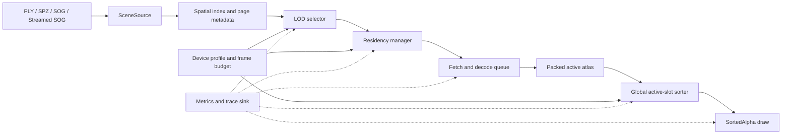

# Native-First Competitive Architecture

## Status

- **State:** proposed; ready for implementation planning
- **Product position:** Android/iOS native performance leadership, desktop Web
  performance parity, and one shared rendering core
- **Release quality path:** `SortedAlpha`
- **Public format policy:** consume ecosystem formats; do not introduce a
  gsplat-rs-specific public scene format in this plan
- **Companion document:** [verification plan](verification_plan.md)

## Executive Summary

gsplat-rs should not try to beat PlayCanvas by recreating a general-purpose Web
engine. Its strongest product boundary is a small Rust renderer with native
Android and Apple SDKs, a C ABI, and the same core available on Web.

The proposed renderer has two operating paths:

1. **SmallSceneDirect** preserves the current GPU-resident, direct sorted-index
   path for scenes that fit comfortably within device limits. It protects the
   low-overhead path that already has positive internal A/B evidence.
2. **PagedActiveAtlas** is the large-scene path. It decodes compressed spatial
   pages directly into a fixed-capacity, texture-backed active atlas, selects
   pages by view and byte/work budgets, globally sorts active slot IDs, and
   renders the active working set with one logical `SortedAlpha` stream.

The large-scene design deliberately differs from PlayCanvas's editable
resource-plus-work-buffer model. gsplat-rs can avoid retaining both a complete
GPU source representation and a second active representation because its SDK
does not need to expose a general scene editor. The source of truth may remain
on disk, network, or CPU cache while only the active working set occupies the
GPU atlas.

This architecture is expected to remove the single 128 MiB storage-buffer
binding as a scene-size boundary and reduce the current roughly 244-byte
attribute representation to a 20-byte hot render record plus a degree-aware SH
sidecar. The full degree-3 target is about 68 attribute bytes, or about 72 bytes
including the order ID; large-scene attribute LOD should target a measured
40-48-byte average attribute payload. These are design targets, not achieved
results; the
[verification plan](verification_plan.md) defines the evidence required before
making performance or capacity claims.

## Product Boundary

### Goals

- Demonstrate sustained Android and iOS native advantages over accessing a
  PlayCanvas viewer through the browser on the same physical device.
- Keep gsplat-rs Web within a defined parity band of PlayCanvas Web on desktop
  browsers under matched rendering and quality conditions.
- Load and render scenes whose total splat count is larger than the active GPU
  working set.
- Remove degree-3 SH storage from a monolithic storage-buffer binding.
- Preserve one renderer, one `SurfaceRenderSession` lifecycle, and one compact
  C ABI across native platforms.
- Preserve correct global `SortedAlpha` ordering for the active working set.
- Make memory, upload, sort, LOD, and streaming decisions observable and
  reproducible.

### Non-goals

- Matching PlayCanvas's engine, editor, entity/component, material, and Web
  ecosystem breadth.
- Claiming that native-vs-browser results isolate renderer efficiency. That is
  a product/deployment comparison; Web-vs-Web is the renderer comparison.
- Replacing `SortedAlpha` with an order-independent approximation to win a
  benchmark.
- Designing a new public gsplat-rs asset format before interoperability paths
  have been measured.
- Making GPU sort the universal default.
- Shipping remote Maven, SwiftPM binary, or npm distribution as part of the
  renderer architecture work. Distribution qualification remains a later
  release phase.
- Treating higher native adapter limits as the main solution. The portable path
  must work within limits reported by lower-tier mobile and browser adapters.

## Claim Boundaries

| Claim | Comparison | Meaning |
|-------|------------|---------|
| Native product advantage | gsplat-rs native app vs PlayCanvas in the normal mobile browser on the same device | Measures the experience an SDK customer can ship, including runtime/deployment differences. |
| Web renderer parity | gsplat-rs Web vs PlayCanvas Web in the same browser and device | Isolates renderer behavior more closely and protects the cross-platform story. |
| Large-scene scalability | Same total scene, view trace, active budget, and quality policy | Proves bounded working-set operation; it is not implied by small-scene frame time. |
| Renderer optimization | Current path vs proposed path inside gsplat-rs | Establishes causality and regression safety but is not a competitor claim. |

Only the first row is expected to become the primary product message. The other
rows are necessary to keep that message technically credible.

## Current Constraint

The current direct path binds scene data as complete storage buffers:

| Resource | Approximate size |
|----------|------------------|
| Base source element | 64 bytes per splat |
| Degree-3 SH rest data | 180 bytes per splat |
| Sorted index | 4 bytes per active splat |
| Total scene-plus-order payload | About 248 bytes per splat, excluding allocator overhead and uniforms |

With a 128 MiB maximum storage-buffer binding, the degree-3 SH binding alone
reaches a theoretical boundary near 745 thousand splats. The base source buffer
reaches its own boundary near 2.1 million splats. Other limits, allocations, and
runtime overhead can lower the practical ceiling.

This is a binding-layout problem, not simply a total-memory problem. Requesting
a larger limit may help a subset of native adapters, but it does not provide a
portable Web/mobile architecture and it still keeps memory proportional to the
entire scene.

## Competitive Reference

PlayCanvas already demonstrates the important general solution:

- splat attributes are represented as GPU texture streams rather than one
  complete attribute storage buffer;
- the active work representation is compact;
- Streamed SOG separates total scene size from a bounded active working set;
- octree LOD, frustum selection, load/unload policy, and global budgets control
  residency;
- GPU sort is selected on WebGPU while a CPU worker path remains available for
  WebGL.

The proposed gsplat-rs path adopts texture-backed active data, spatial pages,
bounded residency, and explicit device policy. It does **not** copy the complete
source-resource plus work-buffer duplication because gsplat-rs can optimize for
rendering rather than general editing.

At the pinned PlayCanvas revision, comments call the compact work buffer “20
bytes per splat,” but the declared streams are `R32U + RGBA32U + R32U`. Their
pixel formats occupy 4 + 16 + 4 = **24 bytes per splat**. This plan treats the
20-byte label as a source comment/accounting mismatch, while using the declared
24-byte layout for analysis.

That 24-byte work buffer is not total active residency. PlayCanvas resources
store their own texture streams and visible resource data is copied into the
work buffer. For example, its compressed degree-3 resource declaration uses one
`RGBA32U` packed stream and three `RGBA32U` SH streams: 64 source bytes per
splat before the work buffer, order, and sort scratch. SPZ uses a roughly
20-byte base resource plus SH. Exact runtime totals still depend on format,
SH bands, streaming lifecycle, allocator behavior, and scratch capacity, so the
comparison must measure renderer-owned bytes rather than rely only on declared
formats.

gsplat-rs can therefore aim beyond parity in two ways: make its hot record no
larger than 20 bytes, and avoid a permanent source-to-work duplication by making
the packed active atlas the canonical render representation. Attribute-level
LOD can further keep full SH only on pages where it materially improves the
image.

Primary references:

- [PlayCanvas rendering architecture](https://developer.playcanvas.com/user-manual/gaussian-splatting/building/rendering-architecture/)
- [PlayCanvas splat data format](https://developer.playcanvas.com/user-manual/gaussian-splatting/building/unified-rendering/splat-data-format/)
- [PlayCanvas work-buffer format](https://developer.playcanvas.com/user-manual/gaussian-splatting/building/unified-rendering/work-buffer-format/)
- [PlayCanvas Streamed SOG](https://developer.playcanvas.com/user-manual/gaussian-splatting/formats/streamed-sog/)
- [Pinned PlayCanvas compact work-buffer declaration](https://github.com/playcanvas/engine/blob/d5fe88878e338936fe763bbce1a58bc315e89cbe/src/scene/gsplat-unified/gsplat-params.js#L86-L101)
- [Pinned PlayCanvas compressed resource declaration](https://github.com/playcanvas/engine/blob/d5fe88878e338936fe763bbce1a58bc315e89cbe/src/scene/gsplat/gsplat-compressed-resource.js#L27-L48)
- [Niantic SPZ](https://github.com/nianticlabs/spz)

## Target Architecture



### Path Selection

`SurfaceRenderSession` remains the public lifecycle owner. Internally it chooses
a geometry source at scene load:

```text
scene + adapter limits + policy
  -> comfortably fits direct-path byte/binding limits
       -> SmallSceneDirect
  -> requires bounded residency or streaming
       -> PagedActiveAtlas
  -> neither path can satisfy required resources
       -> structured preflight error before partial allocation
```

“Comfortably fits” must be computed from reported adapter limits and configured
headroom, not from a hard-coded splat count. The preflight report should include
required bytes, limiting resource, reported limit, chosen path, and remediation.

### SmallSceneDirect

This path retains the existing behavior:

- scene resources stay resident;
- camera changes update sorted `u32` indices rather than re-uploading geometry;
- current CPU radix sort remains the default;
- the shared surface/offscreen semantics and instrumentation remain intact.

It is the rollback path for every large-scene milestone. It also prevents small
assets, SDK smoke tests, and latency-sensitive single-object use cases from
paying atlas construction and streaming-management overhead.

### PagedActiveAtlas

The large-scene path maintains a fixed number of atlas slots. Source pages are
decoded directly into available slots. Rendering refers to a global slot ID,
not a page-local GPU buffer.

A useful prototype geometry is:

- one page: 65,536 splats, mapped as a 256 x 256 texel tile;
- one 2048 x 2048 atlas: 64 such page slots, or 4,194,304 splat slots;
- smaller mobile budgets allocate fewer committed page slots or smaller
  synchronized atlases;
- page size and atlas dimensions remain tuning parameters until device evidence
  freezes them.

The power-of-two prototype simplifies page-to-texel addressing and supports
contiguous queue uploads. It is not a public file-format requirement.

At the prototype page size, the hot record occupies about 1.25 MiB per page,
full degree-3 attributes occupy up to 4.25 MiB, and order IDs add 0.25 MiB.
Budgets must use the selected SH detail rather than assuming every page has the
same byte cost.

## Packed GPU Layout

The renderer should separate data read on every draw from data needed only for
view-dependent color refresh. Synchronized 2D sampled textures use one texel
address derived from the global slot ID.

### Hot Render Record

The production prototype target is 20 bytes per active splat:

| Stream | Candidate representation | Size | Contents |
|--------|--------------------------|------|----------|
| `positionOpacity` | `Rgba16Uint` | 8 bytes | Page-local xyz position; the remaining 16 bits pack opacity and flags. |
| `scaleFlags` | `Rgba8Uint` | 4 bytes | Three log-encoded scales plus one format/LOD byte. |
| `rotation` | `R32Uint` | 4 bytes | Packed quaternion, initially half-angle or smallest-three encoding. |
| `color` | `R32Uint` | 4 bytes | View-evaluated RGB using a frozen packed-color convention. |
| **Total** | | **20 bytes** | Excludes SH sidecar, page metadata, order, and sort scratch. |

Page-local positions are the main opportunity this spatially paged renderer can
exploit: 16-bit coordinates are reconstructed with page bounds rather than
spending 12 bytes on three world-space `f32` values. The fourth 16-bit lane can
carry 8-bit opacity plus flags or a higher-precision opacity, depending on image
evidence.

These candidates exist in the repository's current `wgpu-types 28.0.0`
dependency. The shader should use integer loads rather than filtered sampling.
Page construction must reject or subdivide bounds whose 16-bit position error
exceeds the frozen screen-space/image threshold.

A 16-18-byte research candidate may use tighter position/scale/color packing,
but it cannot become the production target unless it passes the same image,
decode-cost, and cross-backend gates. Twenty bytes is the first implementation
contract, not a claim that the current renderer already achieves it.

### Degree-Aware SH Sidecar

SH is stored separately so residency can vary by page contribution:

| Effective detail | Initial sidecar target | Intended use |
|------------------|------------------------|--------------|
| Degree 0 | 0 bytes | Far/coarse pages use the hot record's baked/view-evaluated color. |
| Degree 1 | Up to 16 bytes | Low-cost directional response. |
| Degree 2 | 24-32 bytes | Mid-distance refinement; final padding depends on texture layout. |
| Degree 3 | Up to 48 bytes | Near/high-contribution pages. |

The initial targets assume quantized coefficients and texture-friendly padding.
More aggressive coefficient quantization is experimental and must not be hidden
inside a performance comparison.

For degree 1-3 pages, the sidecar is read by a bounded color-refresh pass when a
page becomes resident or the camera direction crosses the configured angular
threshold. That pass writes the current view-evaluated color into the hot record.
The main draw then reads only the hot record. Degree-0 pages require no SH
sidecar. Refresh time, bytes written, and update frequency are part of the frame
budget and cannot be omitted from benchmark results.

### Comparable Byte Accounting

The byte model is explicit:

| Configuration | Attributes | Order ID | Comparable total before scratch |
|---------------|------------|----------|---------------------------------|
| Hot record / degree 0 | 20 bytes | 4 bytes | 24 bytes |
| Degree 1 | Up to 36 bytes | 4 bytes | Up to 40 bytes |
| Degree 2 | 44-52 bytes | 4 bytes | 48-56 bytes |
| Full degree 3 | Up to 68 bytes | 4 bytes | Up to 72 bytes |

The large-scene target is a **40-48-byte measured average attribute payload**
before order/scratch, achieved by selecting SH detail independently from splat
count. The full degree-3 path must still be available for parity tests.

Implementation gates are:

- hot render record no larger than **20 bytes per splat**;
- at least a **3x measured reduction** from the current base-plus-SH scene
  payload for the full degree-3 path;
- full degree-3 attributes no larger than **68 bytes per splat** before order;
- no permanent second GPU copy of the active geometry/color representation;
- no single full-scene attribute storage-buffer binding;
- format-specific decode isolated in shader helpers so layout experiments do not
  fork the render pipeline.

The final format must be chosen by image parity, frame-time distribution,
total renderer-owned memory, and energy evidence. A smaller byte count that
increases shader cost or causes visible SH/covariance artifacts does not pass.

## Source and Cache Layers

### `SceneSource`

Introduce an internal asynchronous scene-source abstraction with these logical
operations:

- read scene metadata and bounds;
- enumerate spatial nodes/pages and available LODs;
- request/cancel page payloads;
- decode a page into the renderer's private packed staging representation;
- expose stable content identity for cache validation.

The abstraction is internal first. It must not widen the v0.1 C ABI until at
least one native and one Web end-to-end streaming implementation pass the gates.

### Format Roles

| Format | Initial role |
|--------|--------------|
| PLY | Compatibility and small-scene direct load; optional import-time spatial partitioning for local tests. |
| SPZ | Compact whole-scene transport/storage; useful before full remote page streaming, though whole-file decode can still create a CPU-memory peak. |
| SOG | Compressed interoperable input where decoder and licensing review permit. |
| Streamed SOG | Preferred reference for indexed remote pages and LOD interoperability. |

The private packed atlas layout is a runtime representation, not a promised
on-disk format. If source conversion is required, it should initially be a tool
or cache operation with the original ecosystem format remaining the public
contract.

### CPU and Disk Cache

Use three independent budgets:

1. compressed source cache;
2. decoded/packed CPU staging cache;
3. GPU active atlas.

The GPU budget is smallest and most latency-sensitive. The compressed cache may
retain more distant pages. The decoded cache should be bounded and evictable so
that compression does not merely move the memory spike from GPU to CPU.

## Residency and LOD

`ResidencyManager` owns page state and transitions:

```text
Absent -> Requested -> CompressedReady -> DecodedReady -> Uploading -> Resident
   ^                                                                  |
   +---------------------- Evicting <---------------------------------+
```

Every asynchronous result carries scene revision, page ID, and slot generation.
Results for an old scene, an evicted page, or a reused slot are discarded before
they can mutate the atlas or published order.

### Selection Policy

Start with CPU node selection because it is easier to verify and does not add a
new GPU synchronization dependency. A node's priority should combine:

- frustum visibility;
- projected screen contribution/error;
- distance and camera-motion prediction;
- whether an ancestor is already resident;
- fetch/decode/upload cost;
- recent visibility, with hysteresis and cooldown.

The selector fills budgets in this order:

1. preserve a coarse covering set so holes do not appear;
2. refine visible nodes by projected contribution;
3. reserve upload capacity for newly exposed regions;
4. evict only after hysteresis/cooldown and only when a coarser covering node is
   available or the node is outside the retained region.

GPU node culling is a later optimization. It must not be a prerequisite for the
first correct streaming release.

### Attribute LOD Policy

Spatial LOD chooses which splats are active; attribute LOD independently chooses
how much view-dependent information each resident page carries. The first policy
should use projected contribution with hysteresis:

- coarse/far pages keep degree 0 and use the hot color;
- medium pages opt into degree 1 or 2;
- near or high-error pages opt into degree 3;
- upgrades and downgrades use separate thresholds to avoid SH residency churn;
- a missing higher-degree sidecar never creates a hole because the hot record
  remains renderable.

Parity benchmarks disable attribute LOD and force the same SH degree across
renderers. Product and large-scene benchmarks enable it, report the resident SH
mix, and enforce an image-quality floor. Attribute LOD is not allowed to hide a
quality reduction inside a memory or frame-time result.

### Budget Model

The policy must constrain all of the following:

- active splats;
- GPU atlas bytes;
- CPU compressed and decoded bytes;
- upload bytes per frame;
- fetch/decode concurrency;
- sort time budget;
- target frame time;
- eviction rate and minimum residency duration.

Splat count alone is insufficient because SH degree, packed layout, and update
rate change both bytes and work.

## Global Sorting and Draw Correctness

Pages must not be sorted and drawn independently; that breaks alpha order where
page depth ranges overlap. The active set therefore produces one global list of
atlas slot IDs:

1. gather active slot IDs and reconstructed centers;
2. apply near/far and visibility policy;
3. sort all active IDs by the current `SortedAlpha` depth key;
4. validate the scene/residency revision;
5. upload/publish the order buffer;
6. issue the logical active-set draw.

The existing async-sort revision model should be extended with a residency
revision. Old sort results are dropped if the camera, scene, or slot-generation
snapshot is no longer valid.

### Sort Policy

- **Mobile baseline:** current CPU radix path with measured sort interval and
  async publication.
- **Desktop/Web baseline:** current CPU path until profiling shows sort is the
  dominant p95 cost at the target active budget.
- **GPU candidate:** experimental capability selected only after it is at least
  20% better in p95 end-to-end frame time across the qualification scenes on a
  device class, introduces no image/count failures, and does not cause a
  material energy or stability regression.

The prior Android GPU-sort regression means backend name alone is not a valid
selector. Selection should use a conservative device profile backed by checked
benchmark data; an unknown adapter falls back to CPU.

## Device Policy

`DeviceProfile` is derived from reported limits/features and a small verified
policy table. It produces budgets and path choices rather than branching render
logic by platform name.

Minimum profile inputs:

- backend, adapter identity, driver/OS version where available;
- maximum texture dimension and sampled-texture count;
- storage/uniform binding limits;
- timestamp-query availability;
- device memory class or conservative application-provided budget;
- screen resolution/DPR and target frame interval;
- measured sort/upload capability when a trustworthy cached probe exists.

Native builds may request and use higher adapter limits as an optional fast path,
but assets and shaders must still have a portable atlas path. Web must record
the actual WebGPU adapter/backend signals rather than assuming them from the
browser name.

## Loading and Frame Scheduling

The critical path is split into bounded stages:

```text
metadata -> coarse visible page -> first upload -> first renderable frame
         -> refinement fetch/decode/upload across later frame budgets
```

Requirements:

- no network or file read on the render thread;
- decode workers are bounded and cancellable;
- per-frame upload bytes are capped;
- atlas changes become visible at a frame boundary;
- a coarse resident node remains visible while a refined replacement loads;
- camera jumps cancel low-priority work and prioritize a coarse covering set;
- load progress exposes metadata, fetch, decode, upload, and first-frame timing
  separately.

## API and ABI Evolution

### First implementation

- Keep the current C ABI and platform wrappers unchanged.
- Select the path from existing scene-load inputs and internal configuration.
- Add internal stats and structured Rust errors first.
- Reuse `SurfaceRenderSession`; do not create a separate mobile renderer.

### Additive experimental API

After a native and Web prototype pass correctness gates, consider an additive
configuration object for:

- memory/frame-time target;
- quality/LOD preference;
- source/cache callbacks;
- metrics callback or snapshot;
- explicit direct/atlas override for diagnostics.

Any C ABI addition must update both the Rust FFI implementation and
`gsplat.h`, retain safe defaults, and run the repository FFI smoke route.

### Stable public API

Promote only after:

- two platform integrations use the same semantics;
- cancellation and lifecycle behavior are proven;
- streaming errors are actionable;
- the benchmark artifact schema is stable;
- no private atlas detail is required in the public contract.

## Implementation Phases

The exit gates below use hard correctness and safety as phase blockers.
Performance ratios, 30-minute stability, byte bands, energy/thermal wins, and
full device matrices qualify claims and guide later optimization; a miss is
reported and narrows the claim rather than forcing quality reductions or an
unbounded optimization loop.

### Phase A: Freeze Competitive Baseline

- Extend metrics and percentile output without changing rendering behavior.
- Build the pinned PlayCanvas comparison harness.
- Capture small/medium-scene native and Web baselines.
- Add preflight resource reports for scenes that exceed current limits.

**Exit gate:** reproducible artifacts from at least one Android device, one iOS
device, and desktop Web; current behavior remains unchanged.

### Phase B: Packed Atlas Without Streaming

- Implement the private packed layout and shader decode.
- Load an entire small/medium scene into a fixed atlas.
- Reuse global CPU sorting and direct sorted slot IDs.
- Compare direct and packed paths under identical cameras.

**Exit gate:** image/count parity, valid bounded resource accounting, and no
direct-path regression. Payload reduction, record sizes, and device p95 ratios
remain reported optimization/claim observations.

### Phase C: Compressed Sources and Bounded Decode

- Add SPZ first or another format selected by feasibility review.
- Bound compressed and decoded CPU caches.
- Decode directly into page-aligned staging buffers and upload slots.
- Record cold/warm load phases and peak memory.

**Exit gate:** bounded decode, cancellation, failure recovery, and attribute /
image compatibility pass. Transport and peak-memory deltas are reported rather
than required to beat PLY in every environment.

### Phase D: Spatial Pages and Streaming LOD

- Add spatial metadata, page scheduler, residency state, and hysteresis.
- Start with local page files, then remote range/file fetch.
- Preserve a coarse covering set while refining.
- Select SH degree independently from spatial page detail.
- Extend global sorting across all active slots.

**Exit gate:** page count can exceed fixed atlas slots; camera traces show fixed
active/resident bounds, no non-resident draw, no persistent holes, safe stale /
cancel/generation behavior, non-zero Surface output, and frozen image quality.
Nandi/10M scale, long-run memory, and the 40–48-byte band are observations that
qualify scalability claims.

### Phase E: Policy Optimization

- Tune page size and atlas layout by device class.
- Evaluate GPU node culling and GPU sorting only where profiles show value.
- Add camera-motion prediction and adaptive upload/sort budgets.
- Run sustained thermal/energy qualification.

**Exit gate:** fair matched artifacts and quality receipts exist, performance is
reported, and claim language is restricted to the tested dataset/browser/device
scope. Native leadership, broad Web parity, thermal, and energy numbers qualify
those specific claims but do not block the underlying comparison capability.

### Phase F: Distribution and Claim Promotion

- Qualify AAR/XCFramework/Web package consumption paths.
- Freeze supported formats, lifecycle, telemetry, and error semantics.
- Publish only the claims earned by stored benchmark artifacts.

**Exit gate:** existing local AAR/XCFramework/Web package consumption paths pass
and canonical docs freeze the stable/experimental boundary plus earned and
withheld claims. Registry publication is not required.

## Expected Repository Impact

Exact file placement must follow the architecture at implementation time, but
the intended ownership is:

| Area | Responsibility |
|------|----------------|
| `gsplat-render` | Packed atlas resources, shader decode, slot addressing, sorted-slot draw, stats. |
| `gsplat-core` | Format-independent page/node metadata and stable value types only when broadly shared. |
| `gsplat-io` | Source decoders, page metadata, compressed/cache reads. |
| `gsplat-sort` | Global active-slot sort input and optional measured policies. |
| `gsplat-ffi-c` | Additive configuration/stats only after internal semantics stabilize. |
| Android/Apple bindings | Lifecycle adapters and platform source/cache bridges; no independent renderer logic. |
| `gsplat-web` / Web package | Fetch/cache bridge and benchmark signals using the same session semantics. |
| `tools/bench-runner` and examples | Percentiles, resource telemetry, deterministic traces, artifact export. |

No new crate should be created until existing ownership proves inadequate. The
first prototype belongs behind internal modules and feature flags.

## Failure Modes and Mitigations

| Risk | Mitigation / rollback |
|------|-----------------------|
| Packed decode saves bandwidth but costs too much shader ALU | Maintain layout candidates; select per measured end-to-end p95 and energy, not byte count alone. |
| Texture sampling performs poorly on a device class | Keep SmallSceneDirect and test a second packed representation behind the same logical atlas interface. |
| Page transitions pop or create holes | Require parent/coarse coverage, hysteresis, cooldown, and image-sequence verification. |
| Global sorting becomes the large-active-set bottleneck | Enforce active work budgets first; profile segmented/hierarchical or GPU candidates only after correctness baseline. |
| Async decode/sort publishes stale slots | Validate scene revision, residency revision, page ID, and slot generation before publication. |
| Whole-file compression still spikes CPU memory | Separate compressed and decoded budgets; streamed/indexed formats are required for truly large remote scenes. |
| Native benchmark wins only while cold | Require randomized order, cooldown, thermal reporting, and 30-minute sustained runs. |
| Web parity is achieved by reducing quality | Lock counts, SH degree, camera, resolution, and image thresholds in the manifest. |
| Interoperable format support changes roadmap scope | Keep decoders experimental/internal until legal, compatibility, and maintenance gates pass. |
| Higher native limits hide a portability failure | Run the portable atlas profile even on high-end native devices and keep Web qualification mandatory. |

## Decision Summary

The proposed advantage is not “native is automatically faster.” It is a
measurable combination of:

- a small native SDK surface and direct Metal/Vulkan deployment;
- one shared renderer without browser-only architecture compromises;
- a retained low-overhead direct path for normal scenes;
- a bounded, compressed, texture-backed active representation for large scenes;
- direct source-page-to-atlas streaming without a permanent duplicate GPU work
  representation;
- conservative, device-evidenced sort policy;
- claim gates that include quality, memory, sustained performance, and Web
  parity.

Until those gates pass, the architecture is a technically plausible plan rather
than proof that gsplat-rs is more advanced or faster than PlayCanvas.
