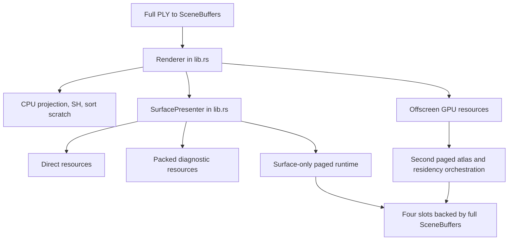
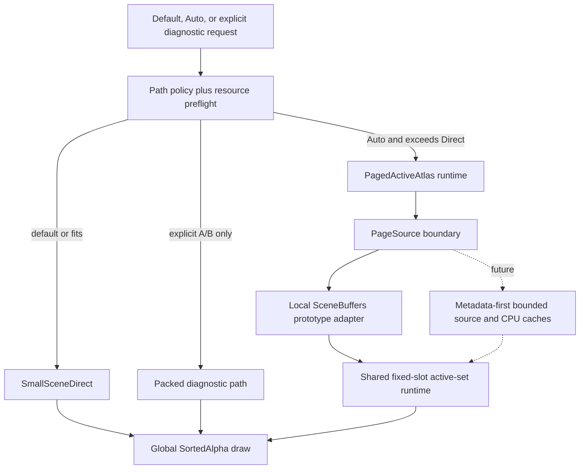

# Task Plan: Render and Paging Architecture Convergence

## Goal

Redesign the `refactor/packed-atlas-d-reset` render/paging architecture so
`SmallSceneDirect` is the clear low-overhead default, `PagedActiveAtlas` is
reserved for scenes that truly exceed Direct capacity, and every cleanup or
move is backed by fresh correctness and platform evidence.

## Current Phase

Architecture convergence remains **in progress**. S1-S5 completed a useful
module-responsibility split, but an independent audit invalidated the prior
overall-complete claim. Corrective A reset acceptance, B fixed automatic
selection against requested device limits, C added typed page-source and
payload validation, and D finished the production cleanup gate at 7,607 lines.
E found that every real SDK needs a new public Auto option or ABI value and
stopped at the authorized API boundary. F completed the exact-HEAD core, Web,
FFI, simulator, and over-slot proof. A fresh Android emulator run now proves
minimal Direct/Paged plus Kitsune Paged, while Kitsune Direct reproduces the
same SH-rest upload crash on `3150b7b` and current code. No physical Android is
connected. The paired physical iPhone later unlocked and completed Kitsune
Direct/Paged on `ca27053`. A bounded SH-rest queue-upload experiment moved the
AVD fault from buffer creation to queue-copy memory and was fully reverted.
The overall goal is now blocked only at the physical-Android device gate.

## Guardrails

- Preserve the public Rust API and v0.1 C ABI unless an impact is documented
  and work stops at a reviewable boundary before the break.
- Do not restore the abandoned telemetry, sidecar, network-adversarial
  validator, or the old `refactor/packed-atlas` tip.
- Delete code only when references, compilation, tests, or A/B evidence prove
  it unused or duplicated. Keep controlled fixtures and conclusion evidence.
- Keep each implementation slice below roughly 800 net-new lines and at most
  two new files. The overall cleanup should reduce production code.
- Commit only independently verified slices. Do not push, force-push, amend,
  change git configuration, or bypass hooks.

## Phases

### Phase 0: Read-Only Audit and Baseline

- [x] Confirm clean `refactor/packed-atlas-d-reset` at `3150b7b`.
- [x] Read canonical handbook docs and the active Phase D-F bundle.
- [x] Map render/path-selection/resource ownership and public API/ABI edges.
- [x] Record dependencies, module sizes, duplicates, and dead-code candidates.
- [x] Run fresh current/main baseline verification and retain comparable output.
- **Status:** complete

### Phase 1: Freeze the Executable Refactor Plan

- [x] Record before/after architecture and explicit ownership boundaries.
- [x] Define independently reviewable implementation slices and rollback points.
- [x] Freeze per-slice Direct/Packed/Paged, safety, Surface, and platform gates.
- [x] Separate the current local fixed-slot prototype from the future
      metadata-first, bounded source/CPU/GPU streaming target.
- **Status:** complete

### Phase 2: Renderer Responsibility Split and Proven Cleanup

- [x] Move cohesive private responsibilities out of the oversized renderer
      root without changing public API or runtime behavior.
- [x] Remove the duplicated Surface geometry-resource construction match.
- [x] Repeat the S1 workspace/renderer/conformance/FFI/hygiene verification.
- [x] Consolidate offscreen and Surface paged active-set orchestration.
- [x] Repeat the S2 path/safety/image/conformance/hygiene verification.
- **Status:** complete

### Phase 3: Direct/Paged Selection Boundary

- [x] Make `SmallSceneDirect` the explicit default low-overhead path.
- [x] Route to `PagedActiveAtlas` only when Direct resource preflight cannot fit
      within the documented capacity/headroom policy or an explicit diagnostic
      override is requested.
- [x] Preserve structured preflight errors and transactional Surface switching.
- **Status:** policy defect fixed in B; product acceptance remains open until E
  connects one real automatic consumer or records an accepted API blocker.

### Phase 4: Paged Architecture Boundary

- [x] Isolate local `SceneBuffers`-backed paging behind an honest prototype
      source boundary without claiming end-to-end streaming.
- [ ] Establish the smallest internal metadata/page-source seam needed for
      future bounded compressed/decoded caches and fixed GPU slots.
- [ ] Preserve coarse-to-fine continuity, one global `SortedAlpha` order, and
      stale/cancel/generation/nonresident safety.
- **Status:** typed lookup and payload safety completed in C. The private source
  still borrows the full scene/page set and remains synchronous, so it is a
  validated uploader seam rather than bounded source or CPU architecture.

### Phase 5: Full Regression and Handoff

- [x] Run workspace, focused renderer, offscreen parity, Surface, FFI, Web, and
      available Android/iOS verification according to touched scope.
- [x] Compare production renderer line counts, excluding terminal
      `#[cfg(test)] mod tests`, and finish below the 7,621-line baseline.
- [x] Reconcile handbook/plan facts with the implemented boundary.
- [ ] Deliver architecture diagrams, deletion/move list, commits, fresh
      evidence, device gaps, and remaining risks.
- **Status:** partial. Exact-HEAD core, Web, FFI, Android build/host smoke, iOS
  simulator Direct/Paged Surface, and fixed-camera over-slot comparison passed
  at `4a8863a`. Android emulator minimal Direct/Paged and Kitsune Paged also
  passed. Kitsune Direct fails identically on `3150b7b` and current code in the
  AVD SH-rest upload, so it is not a refactor regression but is not a Direct
  device pass. Physical iOS then passed both Kitsune paths on `ca27053`:
  Direct drew all 279,199 visible splats and Paged drew 225,784 active residents.
  Physical Android remains absent.

### Corrective Execution A-F

- [x] **A — Acceptance reset:** record the independent audit, restore overall
      `in_progress`, freeze remaining gates, and commit docs only.
- [x] **B — Auto effective limits:** reproduce the bug
      with a pure logic test, apply the smallest fix without API expansion, and
      freshly run renderer lib, required Metal conformance, workspace check,
      strict clippy, formatting, and diff hygiene before an isolated commit.
- [x] **C — Payload boundary:** add typed failure plus payload/source bounds and
      encoding/atlas validation while keeping `LocalScenePageSource`, public
      Rust API, and C ABI behavior stable; verify and commit independently.
- [x] **D — Production cleanup:** reduce renderer production code below 7,621
      lines without deleting tests or shifting the same responsibilities into
      another large file. Prefer smaller Surface policy/device/resource/draw
      owners and proven duplicate removal; keep each slice below 800 net-new
      lines and at most two new files.
- [x] **E — Real automatic consumer:** assess the SDK boundary, then connect
      automatic oversized routing to one minimal real consumer only if that
      does not silently widen the C ABI or product surface. Otherwise record a
      reviewable blocker and stop before API expansion.
- [ ] **F — Blocked on physical Android:** rebuild and retain commit-tagged text
      manifests/logs for workspace, renderer, conformance, FFI, Web, Android
      Direct+Paged, and available iOS Surface. Add fixed-camera over-slot Paged
      count/image comparison for `3150b7b` versus final HEAD. Missing hardware
      produces a partial result, never an overall-complete claim.

### F Evidence Method

- Freeze the evidence HEAD only after the task-local plan and the desktop
  evidence switch are committed; every raw-log directory is named with and
  contains `git rev-parse HEAD` plus clean-worktree status.
- Use `desktop-example --geometry-path paged` with the 279,199-splat Kitsune
  scene, 640x360 output, one frame, auto camera, and zero yaw for the over-slot
  comparison. Record the actual pipeline plus visible/drawn counts, PNG hashes,
  and ImageMagick SSIM.
- Run the baseline in a disposable worktree at `3150b7b` with only the desktop
  evidence-switch commit applied. Require an empty renderer diff against
  `3150b7b`; the synthetic harness commit is not a renderer baseline change.
- Treat ignored build outputs as evidence only when their raw build/run logs
  and manifest are generated from the exact frozen HEAD. Do not infer
  provenance from artifact timestamps.
- A device build is compatibility evidence, not a device-run substitute.
  The refreshed AVD may be counted only for the paths it actually completed:
  minimal Direct/Paged and Kitsune Paged. Its Kitsune Direct SIGSEGV is retained
  with a same-device `3150b7b` reproduction, and cannot be reported as a pass.
  Physical iOS Direct/Paged is now covered. Do not promote the overall goal to
  complete without the missing physical Android Direct/Paged or an explicitly
  accepted reduced platform gate.

## Acceptance Matrix

| Area | Required evidence |
|------|-------------------|
| Workspace | `cargo check --workspace` plus touched-scope tests/lints |
| SortedAlpha | GPU-required conformance when a native adapter is available |
| Offscreen | Direct/Packed/Paged count and image parity fixtures |
| Paging safety | stale, cancel, generation, eviction, and nonresident exclusion tests |
| Surface | stable non-zero direct and paged Surface smoke |
| ABI/platform | FFI smoke and touched Web/mobile routes; device claims only from fresh runs |
| Architecture | smaller renderer root, explicit ownership, no unsupported streaming claim |
| Production size | renderer non-test production code below 7,621 lines; tests/fixtures retained |
| Auto selection | pure logic regression proves selection uses the limits requested from the device |
| Page payload | typed failure for missing page, source-index bounds, count, encoding, and atlas compatibility |
| Surface ownership | `SurfacePresenter` no longer owns negotiation, policy, all resources, refresh, schedule, and draw in one 1,011-line unit |
| Product entry | one real SDK consumer routes oversized scenes automatically, or an explicit API-boundary blocker is accepted |
| Evidence provenance | small commit-tagged text manifest/logs generated from final HEAD; no ignored binary timestamp inference |
| Over-slot image | fixed-camera `3150b7b` vs final Paged count plus image hash/SSIM comparison |

## Architecture Before and Target

### Before

### Implemented Partial State

This is not the accepted target yet. The local adapter still borrows full
`SceneBuffers`, `SpatialPageSet` stores a source index for every splat, decode,
packing, sort, and SH refresh remain synchronous, and automatic selection has
no production consumer. The diagram records the useful module seam only.

## Implementation Slices and Rollback Points

### S1 — Surface ownership split and duplicate removal

- Move `SurfacePresenter`, `SurfacePresenterError`, Surface resource planning,
  and the Surface-local paged wrapper into one `surface_presenter.rs` module.
- Keep crate-root re-exports and every public signature unchanged.
- Replace the duplicated initial/switch Direct/Packed/Paged resource match with
  one helper.
- Rollback: one commit; no serialized state or API changes.
- Verify: `cargo fmt --check`, `cargo check --workspace`, renderer lib tests,
  GPU conformance, and FFI smoke.
- **Status:** complete; crate root reduced from 5,792 to 4,917 lines and
  combined renderer Rust source decreased by six lines.

### S2 — One paged active-set runtime owner

- Consolidate atlas, residency, scheduling, active-entry generation, and page
  upload orchestration used by offscreen and Surface into one internal owner.
- Preserve existing public `PagedAtlasGpu` and residency APIs as compatibility
  surfaces; do not delete CPU fixtures.
- Rollback: independent commit after S1.
- Verify: focused scheduler/residency/paged GPU tests, all Direct/Packed/Paged
  offscreen parity gates, local Surface non-zero test, workspace check, and
  conformance.
- **Status:** complete; one 105-line internal owner replaced duplicated fields,
  initialization, and root synchronization. Net source change from S1 was +26
  lines, so later cleanup must recover this and end below the original total.

### S3 — Explicit path-selection policy

- Keep `GeometryPath::default()` and stable constructors Direct.
- Add an additive automatic selection seam that chooses Direct when preflight
  fits and Paged only when Direct reports `ActiveAtlasRequired`.
- Keep Packed and forced Paged only as explicit diagnostic/A-B overrides.
- Automatic selection must occur before Direct scene GPU allocation and must
  roll renderer state back if Surface preparation fails.
- Rollback: independent policy/API-addition commit; no C ABI changes.
- Verify: small/limit/over-limit policy tests, transactional failure tests,
  Direct/Paged Surface construction paths, FFI smoke, Web WASM check if its
  constructor is touched.
- **Status:** policy slice complete, product entry pending E; stable
  constructors and `GeometryPath::default()`
  remain Direct. Opt-in `*_auto` constructors call
  `select_automatic_surface_geometry_path` only after the compatible adapter
  reports Direct `ActiveAtlasRequired`. B now derives the effective downlevel
  storage/buffer limits used by the device descriptor before Auto preflight and
  resource planning. No production consumer calls these constructors yet.

### S4 — Honest local page-source seam

- Move page extraction/packing out of the fixed-slot GPU uploader into an
  internal page-source payload boundary.
- Implement the current full-`SceneBuffers` behavior as `LocalScenePageSource`;
  label it as unbounded source residency and retain a bounded decoded-page
  cache only if measurements/tests justify it.
- The GPU runtime consumes metadata plus decoded page payloads, not arbitrary
  source containers. Future disk/network sources remain out of scope here.
- Rollback: independent commit; compatibility wrappers retain public methods.
- Verify: payload equivalence, cache bounds if added, stale/cancel/generation,
  nonresident exclusion, count/image parity, Surface smoke, and conformance.
- **Status:** validated local-source slice complete, bounded architecture remains
  a non-claim;
  `LocalScenePageSource` performs extraction and packing,
  and the shared runtime hands only `DecodedPagePayload` to GPU upload. No
  decoded cache was added because payloads are synchronous and transient;
  caching would duplicate the already-full-resident local source without
  evidence of benefit. C changed lookup to typed failure, rejects malformed
  local indices before extraction, and validates payload count, capacity,
  source bounds, encoding, and sidecars before GPU writes. The contract remains
  private, synchronous, and full-source-backed.

### S5 — Proven cleanup, docs, and platform regression

- Remove only private duplicates or unused helpers proven by `rg`, strict
  clippy, tests, or A/B evidence. Do not remove public experimental exports or
  controlled fixtures merely because the repository has no external call site.
- Update canonical docs to distinguish product path policy, local prototype,
  and future true streaming.
- Run final workspace/full renderer/FFI/Web and available mobile checks, then
  compare production lines and commits.
- Rollback: documentation/cleanup commit separate from platform-specific fixes.
- **Status:** module cleanup complete, overall cleanup rejected; shared
  renderer timing/raster helpers, Surface
  constructor helpers, test fixtures, canonical docs, and this proof record
  add 620 lines while deleting 995 in the slice. No new file or test was
  removed. Final renderer Rust source is 10,792 lines versus 10,796 at the
  start, but production code grew from 7,621 to 7,821 while test/fixture code
  fell from 3,175 to 2,971. `lib.rs` is 4,648 versus 5,792, while
  `surface_presenter.rs` has grown to 1,011 lines and still owns too many
  responsibilities.

## Key Questions

1. Which responsibilities can leave `lib.rs` mechanically with no API or
   behavior change?
2. Which duplicate or unused items are provable by references plus fresh tests?
3. Where should automatic path selection live so Direct remains cheap while an
   oversized scene can avoid allocating a full Direct representation?
4. What is the smallest page-source boundary that stops the local prototype
   from defining the future streaming architecture?

## Decisions Made

| Decision | Rationale |
|----------|-----------|
| Use a new task bundle while retaining the Phase D-F bundle as historical evidence | The prior bundle records the bounded prototype as complete; this task has a distinct architecture-convergence goal and must not rewrite that history. |
| Keep Direct as default and paged as oversized-only | This is the original design boundary and current same-device evidence shows small-scene Direct is not the regression source. |
| Establish a fresh main/current baseline before implementation | Later parity and code-size claims need a known behavior/structure reference. |
| Keep public CPU atlas/reference-oracle APIs even when local production references are absent | Repository reference analysis cannot prove downstream users do not depend on public symbols, and controlled fixtures are explicitly protected. |
| Make automatic path selection additive while retaining Direct defaults and explicit A/B overrides | This restores the product boundary without changing stable constructor behavior or losing small-fixture parity coverage. |
| Split Surface ownership before changing paged policy/source semantics | Mechanical movement and duplicate removal can be verified independently from behavior changes. |
| Measure cleanup using production lines excluding terminal test modules | Aggregate source totals hid +200 production lines behind -204 test/fixture lines, so they cannot prove the required cleanup. |
| Execute one blocker at a time in A-F order | The reopened gates are coupled enough that parallel changes would weaken attribution and commit-level verification. |

## Errors Encountered

| Error | Attempt | Resolution |
|-------|---------|------------|
| First S1 compile imported the just-moved `try_prepare_then_commit` from the crate root | 1 | Removed the stale mechanical import; the helper is local to `surface_presenter.rs`. |
| First S1 format check requested standard import ordering | 1 | Applied rustfmt's import grouping and reran the same check. |
| Post-dedup S1 format check requested one standard call compaction | 1 | Applied the exact rustfmt layout; all behavior tests had already passed. |
| First S1 completion-record patch used a stale context line | 1 | Re-read the active bundle and applied smaller context-accurate updates. |
| First S2 test compile still referenced the replaced paged atlas/residency fields | 1 | Updated controlled tests to inspect the same state through `PagedActiveSet`. |
| First S2 format check requested canonical module/import/call layout | 1 | Applied the exact rustfmt output and reran hygiene. |
| First S2 completion-record patch used a stale progress-table context | 1 | Re-read the active bundle and applied smaller context-accurate updates. |
| First S3 format check requested one standard selection-call compaction | 1 | Applied rustfmt's exact layout before adding policy tests. |
| One S3 focused-test command supplied two Cargo filter arguments | 1 | Recorded the command error and reran each focused test with one filter. |
| First S4 audit search named a non-existent `paged_atlas_gpu.rs` path | 1 | Used the discovered `paged_gpu.rs` module and reran targeted inspection. |
| First S4 format check reported standard import and wrapping differences | 1 | Applied rustfmt, then reran compile and verification. |
| FFI command discovery searched a non-existent top-level `scripts/` directory | 1 | Used `handbook/VERIFICATION.md`'s canonical `tests/ffi/run-ffi-smoke.sh` route. |
| S5 duplicate-search used an unsupported default-regex backreference | 1 | Re-ran the reference audit with `rg --pcre2`; no deletion decision depended on the failed search. |
| The first iOS simulator runner did not retain application stdout | 1 | Re-ran the rebuilt app with `simctl --console` and captured the 120-frame result. |
| Browser runtime documentation initially exceeded one tool response | 1 | Read the complete 40,171-character browser contract in bounded chunks before controlling the local page. |
| Overall completion was inferred from aggregate renderer lines and platform runs not reliably bound to final HEAD | 1 | Independent audit invalidated the claim; reopened Phases 3-5 and froze corrective A-F acceptance before further code changes. |
| First B focused-test command used `--exact` with an unqualified unit-test name | 1 | Cargo matched zero tests; rerun uses the full module-qualified test name and the zero-test command is not counted as evidence. |
| First B fix patch used a shortened texture-limit assignment as context | 1 | Patch verification made no code changes; reapplied the same minimal fix in smaller context-accurate hunks. |
| B format check requested canonical wrapping for the strengthened regression call | 1 | Applied rustfmt and reran the complete B verification sequence. |
| First full B verification reached strict clippy with an 8-argument private Surface constructor | 1 | Renderer tests, Metal conformance, and workspace check had passed; grouped adapter info/limits/effective limits into one private context and reran the full sequence without a lint allow. |
| First D1 full verification failed strict clippy on the size gap inside the single-active Surface geometry enum | 1 | Box only the private Paged runtime variant, then rerun every D1 gate from renderer tests. |
| First D2 per-revision line-count shell reused zsh's special `path` parameter | 1 | No repository state changed; renamed it `source_file` and used only the successful rerun for the audit. |
| First F manifest used `git rev-parse head=HEAD`, which Git treated as an invalid revision | 1 | No repository state changed; overwrote the generated log with `git rev-parse HEAD` piped through a label and verified the full SHA. |
| First final-evidence record patch used one stale progress-table context | 1 | No plan file changed; re-read the three exact sections and applied smaller context-accurate patches. |

## Notes

- Re-read this file before every architecture or slice-boundary decision.
- Update `findings.md` after each audit block and `progress.md` after every
  verification or implementation slice.
- Goal completion requires all acceptance evidence; unavailable hardware narrows
  the claim but must not be represented as a pass.
