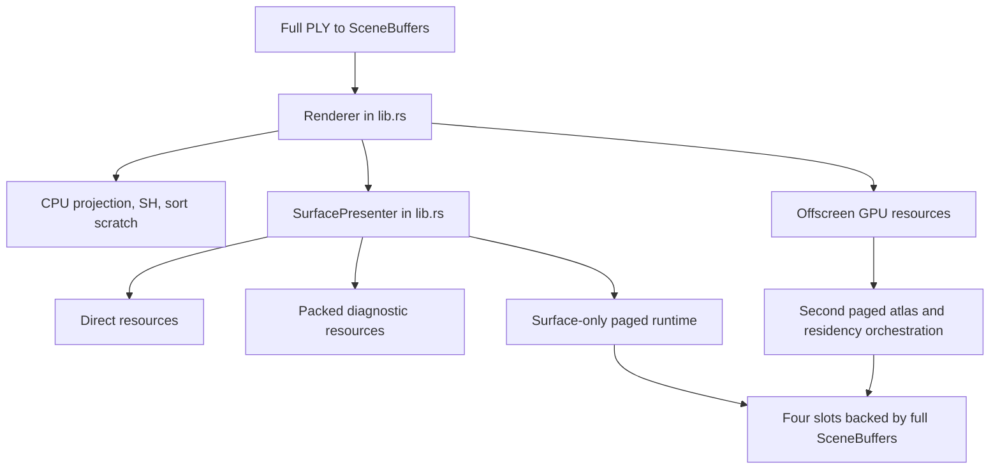
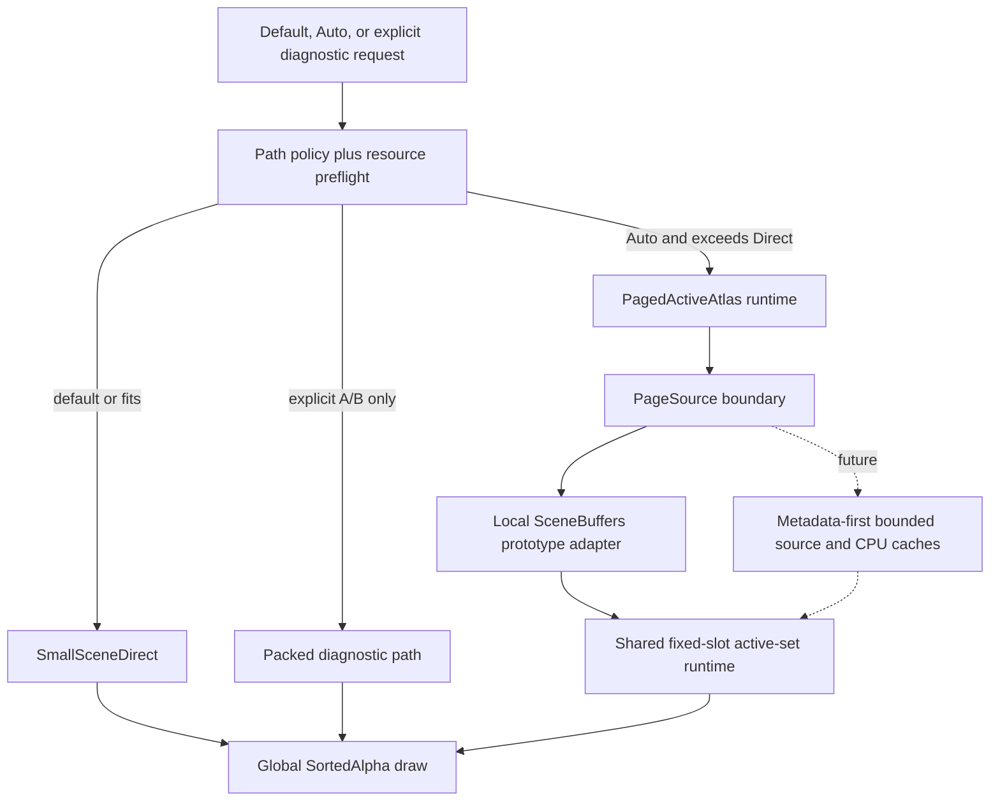

# Task Plan: Render and Paging Architecture Convergence

## Goal

Redesign the `refactor/packed-atlas-d-reset` render/paging architecture so
`SmallSceneDirect` is the clear low-overhead default, `PagedActiveAtlas` is
reserved for scenes that truly exceed Direct capacity, and every cleanup or
move is backed by fresh correctness and platform evidence.

## Current Phase

Phase 3 / Slice S3 — define and integrate additive Direct-first automatic path
selection without changing stable Direct defaults or the C ABI.

## Guardrails

- Preserve the public Rust API and v0.1 C ABI unless an impact is documented
  and work stops at a reviewable boundary before the break.
- Do not restore the abandoned telemetry, sidecar, network-adversarial
  validator, or the old `refactor/packed-atlas` tip.
- Delete code only when references, compilation, tests, or A/B evidence prove
  it unused or duplicated. Keep controlled fixtures and conclusion evidence.
- Keep each implementation slice below roughly 800 net-new lines and at most
  two new files. The overall cleanup should reduce production code.
- Commit only independently verified slices. Do not push, force-push, amend,
  change git configuration, or bypass hooks.

## Phases

### Phase 0: Read-Only Audit and Baseline

- [x] Confirm clean `refactor/packed-atlas-d-reset` at `3150b7b`.
- [x] Read canonical handbook docs and the active Phase D-F bundle.
- [x] Map render/path-selection/resource ownership and public API/ABI edges.
- [x] Record dependencies, module sizes, duplicates, and dead-code candidates.
- [x] Run fresh current/main baseline verification and retain comparable output.
- **Status:** complete

### Phase 1: Freeze the Executable Refactor Plan

- [x] Record before/after architecture and explicit ownership boundaries.
- [x] Define independently reviewable implementation slices and rollback points.
- [x] Freeze per-slice Direct/Packed/Paged, safety, Surface, and platform gates.
- [x] Separate the current local fixed-slot prototype from the future
      metadata-first, bounded source/CPU/GPU streaming target.
- **Status:** complete

### Phase 2: Renderer Responsibility Split and Proven Cleanup

- [x] Move cohesive private responsibilities out of the oversized renderer
      root without changing public API or runtime behavior.
- [x] Remove the duplicated Surface geometry-resource construction match.
- [x] Repeat the S1 workspace/renderer/conformance/FFI/hygiene verification.
- [x] Consolidate offscreen and Surface paged active-set orchestration.
- [x] Repeat the S2 path/safety/image/conformance/hygiene verification.
- **Status:** complete

### Phase 3: Direct/Paged Selection Boundary

- [ ] Make `SmallSceneDirect` the explicit default low-overhead path.
- [ ] Route to `PagedActiveAtlas` only when Direct resource preflight cannot fit
      within the documented capacity/headroom policy or an explicit diagnostic
      override is requested.
- [ ] Preserve structured preflight errors and transactional Surface switching.
- **Status:** in_progress

### Phase 4: Paged Architecture Boundary

- [ ] Isolate local `SceneBuffers`-backed paging behind an honest prototype
      source boundary without claiming end-to-end streaming.
- [ ] Establish the smallest internal metadata/page-source seam needed for
      future bounded compressed/decoded caches and fixed GPU slots.
- [ ] Preserve coarse-to-fine continuity, one global `SortedAlpha` order, and
      stale/cancel/generation/nonresident safety.
- **Status:** pending

### Phase 5: Full Regression and Handoff

- [ ] Run workspace, focused renderer, offscreen parity, Surface, FFI, Web, and
      available Android/iOS verification according to touched scope.
- [ ] Compare production line counts and ownership before/after.
- [ ] Reconcile handbook/plan facts with the implemented boundary.
- [ ] Deliver architecture diagrams, deletion/move list, commits, fresh
      evidence, device gaps, and remaining risks.
- **Status:** pending

## Acceptance Matrix

| Area | Required evidence |
|------|-------------------|
| Workspace | `cargo check --workspace` plus touched-scope tests/lints |
| SortedAlpha | GPU-required conformance when a native adapter is available |
| Offscreen | Direct/Packed/Paged count and image parity fixtures |
| Paging safety | stale, cancel, generation, eviction, and nonresident exclusion tests |
| Surface | stable non-zero direct and paged Surface smoke |
| ABI/platform | FFI smoke and touched Web/mobile routes; device claims only from fresh runs |
| Architecture | smaller renderer root, explicit ownership, no unsupported streaming claim |

## Architecture Before and Target

### Before

### Target for this task

The target does not claim that the local adapter is streaming. It creates the
ownership seam and shared runtime needed to replace it without changing the
draw, residency, or public platform lifecycles.

## Implementation Slices and Rollback Points

### S1 — Surface ownership split and duplicate removal

- Move `SurfacePresenter`, `SurfacePresenterError`, Surface resource planning,
  and the Surface-local paged wrapper into one `surface_presenter.rs` module.
- Keep crate-root re-exports and every public signature unchanged.
- Replace the duplicated initial/switch Direct/Packed/Paged resource match with
  one helper.
- Rollback: one commit; no serialized state or API changes.
- Verify: `cargo fmt --check`, `cargo check --workspace`, renderer lib tests,
  GPU conformance, and FFI smoke.
- **Status:** complete; crate root reduced from 5,792 to 4,917 lines and
  combined renderer Rust source decreased by six lines.

### S2 — One paged active-set runtime owner

- Consolidate atlas, residency, scheduling, active-entry generation, and page
  upload orchestration used by offscreen and Surface into one internal owner.
- Preserve existing public `PagedAtlasGpu` and residency APIs as compatibility
  surfaces; do not delete CPU fixtures.
- Rollback: independent commit after S1.
- Verify: focused scheduler/residency/paged GPU tests, all Direct/Packed/Paged
  offscreen parity gates, local Surface non-zero test, workspace check, and
  conformance.
- **Status:** complete; one 105-line internal owner replaced duplicated fields,
  initialization, and root synchronization. Net source change from S1 was +26
  lines, so later cleanup must recover this and end below the original total.

### S3 — Explicit path-selection policy

- Keep `GeometryPath::default()` and stable constructors Direct.
- Add an additive automatic selection seam that chooses Direct when preflight
  fits and Paged only when Direct reports `ActiveAtlasRequired`.
- Keep Packed and forced Paged only as explicit diagnostic/A-B overrides.
- Automatic selection must occur before Direct scene GPU allocation and must
  roll renderer state back if Surface preparation fails.
- Rollback: independent policy/API-addition commit; no C ABI changes.
- Verify: small/limit/over-limit policy tests, transactional failure tests,
  Direct/Paged Surface construction paths, FFI smoke, Web WASM check if its
  constructor is touched.

### S4 — Honest local page-source seam

- Move page extraction/packing out of the fixed-slot GPU uploader into an
  internal page-source payload boundary.
- Implement the current full-`SceneBuffers` behavior as `LocalScenePageSource`;
  label it as unbounded source residency and retain a bounded decoded-page
  cache only if measurements/tests justify it.
- The GPU runtime consumes metadata plus decoded page payloads, not arbitrary
  source containers. Future disk/network sources remain out of scope here.
- Rollback: independent commit; compatibility wrappers retain public methods.
- Verify: payload equivalence, cache bounds if added, stale/cancel/generation,
  nonresident exclusion, count/image parity, Surface smoke, and conformance.

### S5 — Proven cleanup, docs, and platform regression

- Remove only private duplicates or unused helpers proven by `rg`, strict
  clippy, tests, or A/B evidence. Do not remove public experimental exports or
  controlled fixtures merely because the repository has no external call site.
- Update canonical docs to distinguish product path policy, local prototype,
  and future true streaming.
- Run final workspace/full renderer/FFI/Web and available mobile checks, then
  compare production lines and commits.
- Rollback: documentation/cleanup commit separate from platform-specific fixes.

## Key Questions

1. Which responsibilities can leave `lib.rs` mechanically with no API or
   behavior change?
2. Which duplicate or unused items are provable by references plus fresh tests?
3. Where should automatic path selection live so Direct remains cheap while an
   oversized scene can avoid allocating a full Direct representation?
4. What is the smallest page-source boundary that stops the local prototype
   from defining the future streaming architecture?

## Decisions Made

| Decision | Rationale |
|----------|-----------|
| Use a new task bundle while retaining the Phase D-F bundle as historical evidence | The prior bundle records the bounded prototype as complete; this task has a distinct architecture-convergence goal and must not rewrite that history. |
| Keep Direct as default and paged as oversized-only | This is the original design boundary and current same-device evidence shows small-scene Direct is not the regression source. |
| Establish a fresh main/current baseline before implementation | Later parity and code-size claims need a known behavior/structure reference. |
| Keep public CPU atlas/reference-oracle APIs even when local production references are absent | Repository reference analysis cannot prove downstream users do not depend on public symbols, and controlled fixtures are explicitly protected. |
| Make automatic path selection additive while retaining Direct defaults and explicit A/B overrides | This restores the product boundary without changing stable constructor behavior or losing small-fixture parity coverage. |
| Split Surface ownership before changing paged policy/source semantics | Mechanical movement and duplicate removal can be verified independently from behavior changes. |

## Errors Encountered

| Error | Attempt | Resolution |
|-------|---------|------------|
| First S1 compile imported the just-moved `try_prepare_then_commit` from the crate root | 1 | Removed the stale mechanical import; the helper is local to `surface_presenter.rs`. |
| First S1 format check requested standard import ordering | 1 | Applied rustfmt's import grouping and reran the same check. |
| Post-dedup S1 format check requested one standard call compaction | 1 | Applied the exact rustfmt layout; all behavior tests had already passed. |
| First S1 completion-record patch used a stale context line | 1 | Re-read the active bundle and applied smaller context-accurate updates. |
| First S2 test compile still referenced the replaced paged atlas/residency fields | 1 | Updated controlled tests to inspect the same state through `PagedActiveSet`. |
| First S2 format check requested canonical module/import/call layout | 1 | Applied the exact rustfmt output and reran hygiene. |
| First S2 completion-record patch used a stale progress-table context | 1 | Re-read the active bundle and applied smaller context-accurate updates. |

## Notes

- Re-read this file before every architecture or slice-boundary decision.
- Update `findings.md` after each audit block and `progress.md` after every
  verification or implementation slice.
- Goal completion requires all acceptance evidence; unavailable hardware narrows
  the claim but must not be represented as a pass.
