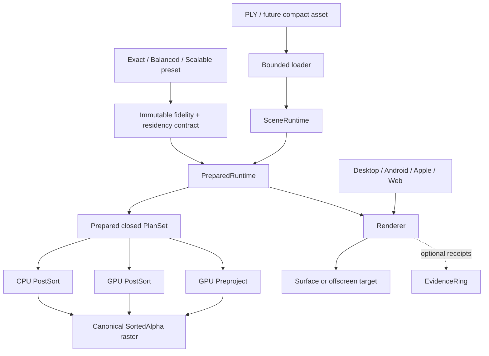
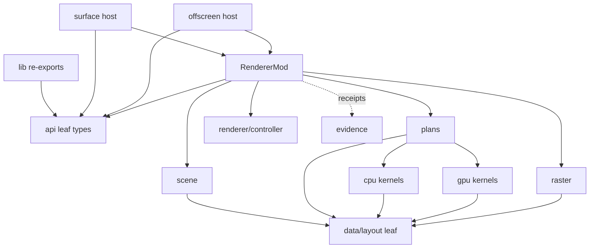
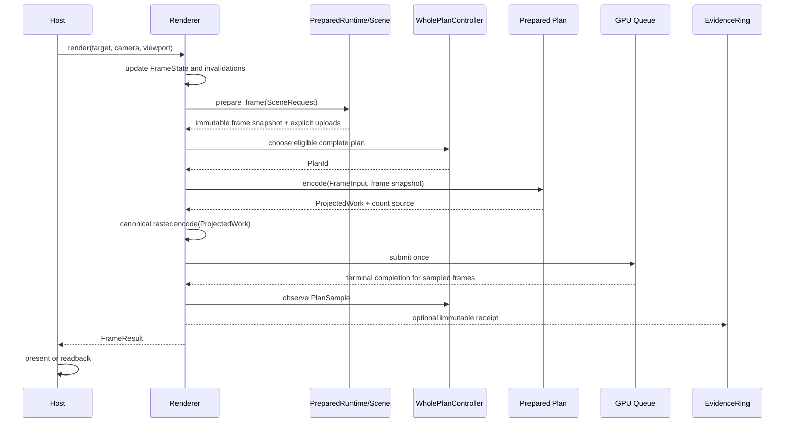
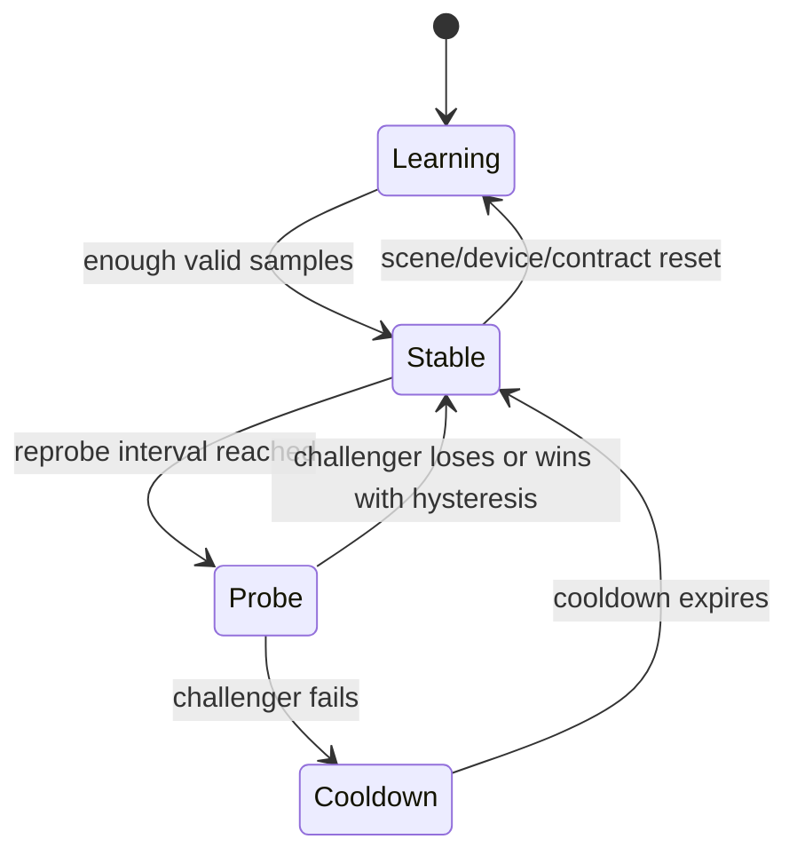
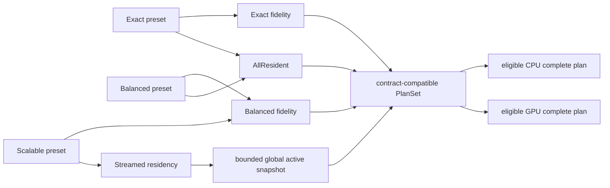

# Native Render Core Architecture

> This document is the architecture contract for
> [task_plan.md](task_plan.md). It describes the target ownership and dependency
> shape. It does not claim that every module already exists.

## 1. Design intent

This is an ownership and execution-plan refactor on top of the completed Exact
renderer. It is not a second rewrite of Resident encoding, stable sorting,
contributor evidence or platform integration.

The architecture optimizes for four properties in this order:

1. semantic clarity: Exact, Balanced and Scalable cannot be confused;
2. one owner for runtime state;
3. static, reviewable hot paths without abstraction tax;
4. small independently testable modules that allow targeted native and GPU
   optimization.

## 2. Product boundary

The host chooses one preset when constructing or transactionally replacing a
renderer. The preset expands into orthogonal immutable fidelity and residency
contracts plus an allowed set of prepared execution plans. Preset identity does
not enter kernels.



Exact and Balanced presets expand to `ResidencyContract::AllResident`.
Scalable expands to `ResidencyContract::Streamed`; its active set still enters
the same plan boundary and global ordering/raster code. Scalable never pretends
that its active set equals the complete source set. The initial core-refactor
and Exact work packages permit only `AllResident`; Streamed is introduced by a
separate Scalable work package.

## 3. Ownership model

“Two objects” means two ownership concepts, not two source files.

### 3.1 `SceneRuntime`

`SceneRuntime` owns scene representation, data and caches. It does not own
camera, frame revision, plan policy, page scheduling policy, evidence or
presentation.

```rust
enum SceneRuntime {
    Resident(ResidentScene),
    Streamed(StreamedScene),
}
```

Responsibilities:

- source identity and source count;
- source SH degree and coordinate contract;
- immutable CPU/GPU scene resources inside one prepared runtime;
- resource layout and byte receipts;
- capacity preflight;
- for Scalable only: metadata, cache budgets, decoded/page data and cache state;
- drain completed asynchronous data work only when Renderer calls
  `prepare_frame(SceneRequest)`;
- return an immutable generation-tagged frame snapshot plus an explicit upload
  batch for Renderer to encode.

Forbidden responsibilities:

- select CPU/GPU/Preproject;
- autonomously tick, select pages or submit uploads;
- own adaptive learning;
- submit GPU work;
- acquire/present a Surface;
- publish benchmark evidence;
- parse runtime environment overrides every frame.

Immediate GPU encoding may borrow a narrow `SplatSetView` for the duration of
one `Renderer::render` call. Native asynchronous CPU ordering receives owned
`Arc` position data and copied camera inputs; it never retains a borrowed frame
view across calls.

### 3.2 `Renderer`

`Renderer` is the only owner of frame execution state.

```rust
struct Renderer {
    gpu: GpuContext,
    runtime: PreparedRuntime,
    frame: FrameState,
    controller: WholePlanController,
    sampler: PlanSampler,
    evidence: Option<EvidenceRing>,
}

struct PreparedRuntime {
    contract: RenderContract,
    scene: SceneRuntime,
    plans: PlanSet,
    raster: CanonicalRaster,
}
```

Responsibilities:

- own camera, viewport and frame generations through `FrameState`;
- transactionally prepare one complete `PreparedRuntime` bundle;
- select exactly one complete plan for a frame;
- encode the frame into one command stream where supported;
- submit, track terminal completion and update the controller;
- invalidate caches on scene/camera/viewport/plan changes;
- publish a narrow `FrameResult`;
- optionally send immutable receipts to `EvidenceRing`.

Only `Renderer` may change the active `PlanId`. No child module receives
`&mut Renderer`.

Scene, contract, PlanSet and raster resources are never replaced separately.
Preparation builds a complete candidate `PreparedRuntime`; one swap publishes
it, and failure leaves the old bundle usable. This prevents bind groups and
scratch resources from pointing at a prior scene layout.

### 3.3 Hosts

`surface.rs` and `offscreen.rs` are hosts around the same renderer core.

- Surface host: acquire, handle unavailable/lost/outdated states, call the
  renderer only after successful acquisition, and present only a submitted
  frame.
- Offscreen host: provide a texture target, call the renderer, optionally
  readback after completion.
- Platform wrappers: adapt native handles, threading/queue ownership and user
  input.

Hosts do not own plan caches, camera revisions, sort intervals or adaptive
states.

An unavailable/lost acquisition does not advance `FrameState` or a probe.
Resize is applied through Renderer and advances the viewport generation there.
Offscreen readback consumes the completion identity returned by Renderer rather
than creating a second completion ledger.

## 4. Internal execution contracts

### 4.1 Public preset, private contract

The conceptual public API is deliberately small:

```rust
pub enum RenderProfile {
    Exact,
    Balanced,
    Scalable,
}
```

The enum remains internal until the migration/SDK work package decides how it
fits the v0.1 release boundary. Internally it is only a constructor input. It
expands to an orthogonal frozen contract whose fields cannot be constructed in
contradictory combinations:

```rust
struct RenderContract {
    fidelity: FidelityContract,
    residency: ResidencyContract,
    source_membership: MembershipContract,
    sh: ShContract,
    resolution: ResolutionContract,
    order: OrderContract,
    resident_precision: ResidentPrecision,
    projected_precision: ProjectedPrecision,
    scalable_quality: Option<ScalableQualityContract>,
}
```

Preset mapping is fixed:

```text
Exact    -> Fidelity::Exact    + Residency::AllResident
Balanced -> Fidelity::Balanced + Residency::AllResident
Scalable -> Fidelity::Balanced + Residency::Streamed
```

Private constructors validate allowed combinations; kernels receive only the
resolved narrow precision/order/layout values they use, never `RenderProfile`.
`RenderContract` is not mutated in the hot loop. Changing preset performs a
transactional `PreparedRuntime` replacement; failure leaves the old renderer
usable.

### 4.2 Closed complete plans

The initial private plan closure is:

```rust
enum PlanId {
    CpuPostSort,
    GpuPostSort,
    GpuPreproject,
}

struct PlanSet {
    fallback: PlanId,
    eligible: EligiblePlans, // fixed [PlanId; 3] + logical length
    cpu_post: Option<CpuPostSortPlan>,
    gpu_post: Option<GpuPostSortPlan>,
    gpu_pre: Option<GpuPreprojectPlan>,
}
```

The only hot dispatch is one exhaustive match:

```rust
let work: ProjectedWork = self.runtime.plans.encode(plan_id, input)?;
```

Construction validates a non-empty contract-compatible eligible set and a
present fallback. `WholePlanController` receives only `eligible()`. Dispatch is
an exhaustive internal match that returns a structured invariant error if a
prepared entry is unexpectedly absent; product correctness never relies on an
`unwrap()` or on the controller “never making a mistake.”

There is no public `RenderPlan` trait, `Vec<Box<dyn Pass>>`, arbitrary pass DAG
or per-frame dependency graph traversal. Concrete plans may share lower-level
kernels, but a review always sees a complete plan and its complete resource
graph.

New variants require:

- a new concrete module;
- a `plan_contract` test entry;
- a profile admission decision;
- a resource/preflight receipt;
- explicit fallback behavior;
- evidence before product promotion.

Plans encode ordering/projection/compaction work and return one canonical
`ProjectedWork` plus exact/indirect count identity. Renderer then invokes
`CanonicalRaster::encode` exactly once and owns submission. Plans do not import
or duplicate raster state.

## 5. Target source layout

The first refactor stays inside `crates/gsplat-render-wgpu`. A new crate is not
created merely to make files smaller.

```text
crates/gsplat-render-wgpu/src/
  lib.rs                       public re-exports only
  api.rs                       stable options, errors, frame result
  data/
    mod.rs                     strategy-free data facade
    layout.rs                  kernel-visible Rust/WGSL ABI contracts
    view.rs                    SplatSetView, owned CPU input, frame snapshot

  renderer/
    mod.rs                     Renderer and top-level frame orchestration
    frame.rs                   camera/viewport/scene/plan generations
    controller.rs              pure whole-plan Adaptive policy

  scene/
    mod.rs                     SceneRuntime; constructs data views/snapshots
    builder.rs                 transactional construction
    resident.rs                exact-count resident ownership
    streamed.rs                future Scalable ownership
    budget.rs                  scene-private resource accounting/preflight

  plans/
    mod.rs                     PlanId, fail-closed PlanSet, ProjectedWork
    cpu_post.rs                complete CPU PostSort plan
    gpu_post.rs                complete GPU PostSort plan
    gpu_pre.rs                 complete GPU Preproject plan

  cpu/
    mod.rs                     CpuOrderEngine
    preprocess.rs              scalar/NEON/AVX2 dispatch
    workspace.rs               reusable keys/IDs/radix/chunk scratch

  gpu/
    mod.rs                     narrow shared GPU types
    project.rs
    compact.rs
    scan.rs
    radix.rs
    color.rs
    indirect.rs

  raster/
    mod.rs                     canonical raster facade
    pipeline.rs                pipeline/layout preparation
    encode.rs                  one exact projected draw

  evidence/
    mod.rs                     immutable receipt types
    ring.rs                    optional bounded persistence observer

  surface/
    mod.rs                     Surface host facade
    lifecycle.rs               acquire/lost/outdated/present protocol

  offscreen/
    mod.rs                     offscreen host facade
    target.rs                  render target ownership
    readback.rs                completion-bound image readback
```

Tests that need private access live next to modules in `tests.rs`; cross-plan
contracts live under crate integration tests. Large device datasets and
benchmark collectors stay under `tests/perf/` and `tests/competitive/`.

## 6. Dependency direction



Mechanical rules:

- `gpu/*` does not depend on renderer, plans, controller, evidence, Surface or
  platform wrappers.
- `cpu/*` does not depend on renderer, plans, controller, evidence or hosts.
- plan modules do not depend on controller, evidence or platform hosts.
- data/layout is a strategy-free leaf; kernels never import the high-level
  `SceneRuntime` enum.
- controller is pure Rust and has no `wgpu` or platform dependency.
- evidence can observe renderer outcomes but nothing imports evidence to make a
  decision.
- Surface/offscreen call Renderer; Renderer never imports a platform SDK.
- lower layers take narrow inputs and return `PlanOutcome`/`ProjectedWork`, not
  `&mut Renderer`.
- plans return `ProjectedWork`; only Renderer calls canonical raster and
  submits.
- only the Surface host presents.
- only the offscreen host initiates product readback.

A1 enforces the most important rules with a lightweight repository script.

## 7. Frame lifecycle



`FrameResult` remains small. Product code needs status, counts, actual plan,
actual CPU/GPU order lane and presentation identity; detailed phase diagnostics
belong in optional evidence.

## 8. Frame state and invalidation

`FrameState` owns the semantic monotonically increasing generations:

```text
scene_generation
camera_revision
viewport_generation
contract_generation
plan_set_generation
```

Derived cache guards contain the generations they depend on. A cache may be
reused only if its complete guard matches. There is no collection of loosely
related booleans such as `dirty_sort`, `dirty_color`, `dirty_projection` spread
across hosts.

Examples:

- order depends on scene + camera/order projection + contract;
- view-dependent SH color depends on scene + camera position + contract;
- each prepared plan owns its own cache and complete cache guard;
- a projected cache depends on scene + complete camera + viewport + order owner
  and generation + contract + exact draw count;
- raster pipeline depends on target format/sample count + contract;
- a profile or scene replacement invalidates all plan-dependent caches
  transactionally.

`plan_set_generation` changes only when plan resources are rebuilt because of a
scene, contract, device or resize transition. Merely selecting a different
active `PlanId` does not invalidate another prepared plan's cache; otherwise
every Adaptive probe would measure an artificial cold start. Stationary frames
may reuse exact order/color/projection. Cache reuse is a plan optimization, not
a separate public render mode.

Plan-local resources may store guards and resource versions, but may not create
independent scene/camera/viewport revisions. Replacing the prepared runtime
cancels outstanding old-generation samples/tickets.

## 9. CPU order engine

### 9.1 One implementation

`CpuOrderEngine` serves synchronous Surface, asynchronous native ordering and
offscreen rendering. It owns a reusable `CpuOrderWorkspace` and exposes one
semantic operation:

```rust
fn order(&mut self, scene: CpuSceneRef, camera: OrderCamera) -> CpuOrderResult;
```

The async worker owns an engine instance; it does not duplicate scalar
preprocess or construct a new sorter per request.

CPU input layout is fixed before new intrinsics are written. The plan chooses
the existing AoS positions, adds `#[repr(C)]` to `gsplat_core::Vec3f`, and locks
`size_of == 12`, `align_of == 4` and x/y/z offsets `0/4/8` with compile-time or
unit assertions. `CpuPositionView` wraps this layout. NEON may use an
interleaved load; x86 may use safe field loads or measured gathers, but neither
may assume an undocumented Rust layout. A separate SoA copy is not introduced
unless a later isolated experiment accounts for its conversion and memory cost.

### 9.2 Internal native kernels

```rust
enum CpuPreprocessKernel {
    Scalar,
    NeonFma4,
    Avx2Fma8,
}
```

- AArch64 NEON covers Android, iOS and Apple Silicon.
- x86_64 selects AVX2 + FMA at runtime.
- unsupported architectures use Scalar.
- stable Rust `std::arch` is used; unstable `std::simd` is not required.
- inclusive clip checks, arithmetic order, compacted lane order and stable
  source-ID ties match Scalar exactly.
- Rayon/chunk count is calibrated once from a bounded candidate set, then
  frozen until scene/device reset.

CPU kernel selection is not another ongoing adaptive controller.

The calibration candidate set and budget are fixed:

- kernels: `Scalar` and the fastest already-qualified SIMD kernel supported by
  the current CPU;
- chunk counts: deduplicated `{1, 2, min(4, available_parallelism)}`;
- input: deterministic first `min(scene_count, 500_000)` positions;
- samples: one warmup plus three measured calls per candidate;
- statistic: median terminal CPU order duration;
- noise band: 5%; within it, choose fewer chunks, then the simpler kernel;
- total wall budget: 500 ms; invalid timing or budget expiry uses the accepted
  static fallback recorded by the baseline task;
- rerun only after scene/device reset;
- WASM: Scalar/serial, no calibration;
- no core pinning and no permanent private Rayon pool.

## 10. GPU kernels and plans

GPU files implement reusable mechanics, not policy.

### 10.1 Kernel responsibilities

- `project`: exact source-to-screen/depth/conic projection;
- `compact`: deterministic stable prefix selection;
- `scan`: hierarchical portable prefix scan for arbitrary lengths;
- `radix`: stable key/value reorder, profile-specified key width;
- `color`: coherent view-dependent SH resolve;
- `indirect`: validated dispatch/draw argument production.

Each kernel declares:

- input/output layouts;
- capacity and alignment rules;
- binding and scratch requirements;
- supported dispatch shape;
- exact edge cases;
- no submission/readback side effects.

### 10.2 Complete plans

`CpuPostSortPlan`:

```text
CPU visible/depth/key -> CPU stable radix -> upload ordered IDs
-> GPU project visible ranks -> ProjectedWork
```

`GpuPostSortPlan`:

```text
GPU visible/depth/key -> stable compact -> GPU stable radix
-> GPU project visible ranks -> ProjectedWork with indirect count
```

`GpuPreprojectPlan`:

```text
GPU project all source splats -> exact contributor compact
-> stable sort contributor prefix -> ProjectedWork with indirect count
```

The existing Preproject implementation is evidence and code to consolidate,
not a reason to create a fourth producer-level controller.

### 10.3 Raster boundary

`raster/` owns the one qualified projected-quad blend contract. Renderer calls
it once with a plan's `ProjectedWork`. A tiled
implementation can only become a complete Plan variant after passing the same
profile oracle; it is not a hidden toggle inside another plan.

Raster math, alpha cutoff, covariance compensation, premultiplied blending and
quad topology are versioned by tests. An optimization cannot change them while
claiming to be a responsibility-only refactor.

## 11. Whole-plan Adaptive

The controller compares complete plans that satisfy the same `RenderContract`.
Its mandatory `PlanSampler` is an internal bounded measurement service; it
exists even when optional external evidence is disabled.



Rules:

- only eligible plans for the current immutable contract can compete;
- metric is the same terminal frame-completion interval;
- diagnostic phase timings never drive selection;
- probes are limited and tagged with scene, camera, viewport, contract and
  plan-set generations;
- an order refresh and a plan probe cannot silently overlap if that would make
  the sample incomparable;
- a failure disables the challenger for a bounded cooldown;
- hysteresis and minimum residency prevent oscillation;
- evidence-ring pressure cannot change policy;
- no point-count threshold selects the winner;
- no controller nests inside a plan.

For native CPU, initialization-time Scalar/SIMD/thread calibration is separate
and frozen. Whole-plan Adaptive sees only the resulting complete CPU plan.

Renderer produces one immutable terminal `PlanSample`. It always feeds the
mandatory sampler/controller path; `EvidenceRing`, when enabled, receives a
copy. A full or disabled evidence ring cannot suppress, delay or alter Adaptive
measurement.

## 12. Evidence boundary

Evidence is opt-in and bounded. It receives immutable events after the renderer
has already made and executed a decision.

Minimum identities:

- scene/content hash and source count;
- source/resident SH degree;
- requested/presented dimensions;
- profile and complete PlanId;
- camera/scene/viewport/contract/plan generations;
- source, visible, contributor and drawn counts with explicit availability;
- queue-terminal sample identity;
- failure or dropped/expired receipt reason.

The existing S/V/C/D and ticket + camera-revision contract is consolidated;
the refactor does not invent a fourth count vocabulary.

Product builds may disable detailed evidence while retaining small frame stats.
Benchmark-only branches must not be injected into plan encode methods.

## 13. Resource preparation

All large resources, pipelines, bind groups and scratch buffers are prepared as
one candidate `PreparedRuntime` at construction, scene replacement, preset
change or resize. A normal frame may
write small uniforms and reused buffers but does not:

- create adapters/devices/pipelines;
- allocate unbounded vectors;
- parse environment variables;
- build a runtime pass graph;
- map/read back data for product execution;
- block on diagnostic evidence.

Preparation performs:

1. contract construction and scene/preset resource accounting;
2. adapter-limit intersection;
3. exact eligible-plan selection;
4. allocation under validation/OOM scopes;
5. pipeline and bind-group construction;
6. validate at least one same-contract fallback plan;
7. complete bundle publication only after success.

## 14. Profiles and plan admission



An arrow means “may be eligible when prepared and qualified,” not “must always
exist.” Device limits can remove a plan from `PlanSet`. If no plan satisfies the
requested profile, preparation returns a structured unsupported/capacity error.

## 15. Scalable ownership

`StreamedScene` is deliberately later and belongs to a separate work package:

```text
SceneManifest
  -> PageSource
  -> compressed cache (bytes)
  -> decoded cache (pages)
  -> fixed GPU page pool
  -> active-set data preparation
  -> one immutable global frame snapshot
```

Required behavior:

- bootstrap/parents cover the scene before refinements arrive;
- children atomically replace parent coverage;
- page failure keeps valid parent coverage;
- cache and upload budgets are byte-based;
- active pages are merged into one global order;
- pages are never independently alpha-sorted;
- a Scalable receipt reports represented hierarchy nodes and estimated error,
  not fake source/resident equality.

The old four-slot Paged prototype borrows complete `SceneBuffers` and schedules
synchronously; it cannot implement this ownership model by renaming types.

`StreamedScene` does not run its own cross-frame scheduler. Renderer supplies a
`SceneRequest`, decides when completed page/decode work is drained, encodes the
returned upload batch and advances the semantic generation only when a new
immutable active snapshot is published.

## 16. Maintainability guardrails

- `lib.rs` is a facade and re-export boundary, not a renderer owner.
- `renderer/mod.rs` composes focused components instead of accumulating their
  algorithms, resources and policy state.
- each plan describes one immutable execution choice; top-level frame
  orchestration coordinates owners rather than implementing their internals.
- production Rust and WGSL modules are split only at real responsibility,
  dependency and test boundaries. Physical LOC is recorded as review evidence,
  never used as a writer quota.
- a newly introduced multi-thousand-line owner requires explicit responsibility
  review. A finite documented exception is valid when the owner is cohesive;
  the review trigger must not force an artificial split or block closeout.
- renderer should have roughly 5--7 top-level private components, not dozens of
  flat fields; this is a review smell, not a gameable field-count hard gate.
- `FrameResult` carries completion identity and compact summary state; detailed
  evidence is separate, and nested giant objects do not satisfy the intent.
- no new top-level crate until an extracted component has a real second
  consumer and stable boundary.
- environment/diagnostic selection is parsed during preparation.
- experimental shaders live outside production imports and require explicit
  non-default compilation or test routing.
- architecture tests check forbidden imports/operations in hot modules.

The LOC checker counts physical lines including tests and comments. Diagnostic
notices never force a task to split a cohesive owner and are not copied into
writer prompts. Existing oversized files enter a checked allowlist containing
baseline line count, responsible extraction task and semantic exit condition.
They may not grow without a bounded exception. A circuit-breaker exception
names a maximum temporary delta, reason and removal task and expires at that
task's closeout.
Moving tests can lower LOC, but a responsibility-extraction task passes only
when its dependency/ownership assertions also pass.

## 17. Historical inputs, not work to repeat

The new architecture must reuse and reference these completed records:

- [full-quality design](../../completed/2026-07-22-full-quality-native-rendering/design.md)
- [final report](../../completed/2026-07-22-full-quality-native-rendering/final-report.md)
- [findings and competitor audit](../../completed/2026-07-22-full-quality-native-rendering/findings.md)
- [Preproject architecture](../../completed/2026-07-22-full-quality-native-rendering/phase2-preproject-c-architecture.md)
- [exact contributor evidence](../../completed/2026-07-22-full-quality-native-rendering/exact-contributor-evidence.md)
- [parallel CPU radix](../../completed/2026-07-22-full-quality-native-rendering/cpu-parallel-radix.md)

Already accepted or rejected experiments are not rerun under a new name. In
particular:

- Direct/Resident full-count and SH parity are established;
- CPU/GPU depth semantics and S/V/C/D definitions are established;
- Preproject/Compact exists and is image-exact; the task is to make it a clean
  complete plan;
- Metal radix8 was accepted, while Adreno radix8 and the slower portable
  local-rank variant were rejected;
- existing NEON/AVX2 code is consolidated before new kernels are added;
- early fragment-support variants that regressed performance remain rejected;
- 640x360 is diagnostic only;
- iOS simulator is functional evidence, not physical-device performance.

## 18. Architecture acceptance test

The ownership refactor is complete only when a reviewer can answer these
questions from module boundaries rather than historical knowledge:

- Where is the current plan selected? `Renderer` via one controller.
- Who owns camera and cache generations? `FrameState` under `Renderer`.
- Who owns scene residency? `SceneRuntime`.
- Who may submit? `Renderer`.
- Who may present? Surface host.
- Can evidence alter a frame? No.
- Can a plan silently lower quality? No; profile admission prevents it.
- Can a platform wrapper implement its own policy? No.
- Can a new GPU kernel import Surface/session state? No.
- Is CPU/GPU choice based on a fixed point threshold? No.
- Is Scalable full-quality? No; its receipt uses a distinct contract.
