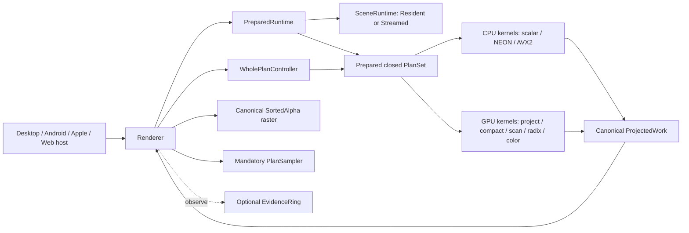
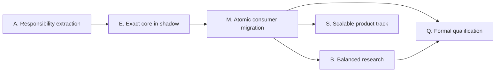

# Native Render Core Refactor

> Status: active design and execution plan
> Created: 2026-07-23
> Planning baseline: `codex/full-quality-native-rendering` at `5db2520`
> Integration baseline: to be frozen by A0 before implementation starts
> Route owner: this file
> Architecture contract: [architecture.md](architecture.md)
> Verification contract: [benchmark_protocol.md](benchmark_protocol.md)
> Current-task ledger: [progress.md](progress.md)

## 1. Why this plan exists

The preceding full-quality work proved that `gsplat-rs` can load and render the
complete source point set, preserve source SH0--SH3, run on Metal, Vulkan and
browser WebGPU, and choose CPU or GPU ordering using measurements instead of a
fixed point-count rule. It also accumulated too many independent strategy axes,
adaptive controllers, telemetry paths and very large source files.

The next step is not another broad performance experiment. It is a controlled
reconstruction of the render core around a small ownership model and a closed
set of complete execution plans. Performance work then proceeds as small,
independently reversible tasks on that core.

This plan restores the original refactor goals that must not be lost:

1. keep the renderer native, shared and written in Rust + `wgpu`;
2. preserve complete source membership, source SH degree, declared resolution
   and `SortedAlpha` semantics in the full-quality contract;
3. retain measured CPU/GPU selection rather than making GPU ordering mandatory;
4. exploit native CPU capabilities, including stable Rust NEON and AVX2/FMA
   kernels, reusable workspaces and native threading;
5. reduce GPU passes, memory traffic and redundant projection/sort work;
6. support small through multi-million-splat scenes without silently sampling;
7. separate exact rendering, explicit quality/performance trade-offs and true
   scalable LOD so that one mode never masquerades as another;
8. make the open-source code reviewable: no new 5,000-line core files, no
   combinatorial public policy surface and no benchmark-only state machine in
   the product frame loop;
9. compare with PlayCanvas fairly, using matched assets, cameras, backing
   resolution, active source membership and terminal timing;
10. split implementation into finite tasks that can end as **Accept**,
    **Reject** or **Defer**, so Codex cannot loop indefinitely around a fixed FPS
    target.

## 2. Non-negotiable invariants

These invariants apply to every task unless a task explicitly belongs to the
separately labelled `Scalable` profile.

- `SortedAlpha` remains the only release-gated blend contract.
- `source == decoded == encoded == resident == addressable` for Exact and
  Balanced evidence.
- Every source splat is considered. Exact visibility/contributor rejection is
  allowed; sampling, hidden LOD and draw-budget truncation are not.
- The source SH degree is preserved. A lower SH degree is a different explicit
  product contract, not an optimization of the same run.
- Requested, Surface, internal render and presented dimensions match. Dynamic
  resolution and upscaling are disabled for qualification evidence.
- CPU and GPU ordering share the same visibility, depth direction, clipping and
  deterministic tie contract.
- An unsupported SIMD kernel, GPU plan or device feature falls back to another
  plan in the same quality profile, never to lower quality.
- Surface, offscreen, Android, Apple and Web hosts adapt lifecycle and handles;
  they do not own renderer policy, cache generations or a second adaptive
  controller.
- Telemetry observes decisions and outcomes. It does not make product
  decisions.
- Capacity or allocation failure is reported before publication. It never
  silently selects the historical fixed-slot Paged diagnostic.

## 3. What is already known

The refactor starts from evidence, not from an assumption that all previous work
was useless.

Historical detail remains in the completed
[task plan](../../completed/2026-07-22-full-quality-native-rendering/task_plan.md),
[final report](../../completed/2026-07-22-full-quality-native-rendering/final-report.md),
[design](../../completed/2026-07-22-full-quality-native-rendering/design.md) and
[findings](../../completed/2026-07-22-full-quality-native-rendering/findings.md).
This active plan links to those records instead of copying their long result
tables.

### 3.1 Working capabilities to preserve

- Exact-count compact Resident/Packed loading and complete SH0--SH3 retention.
- Direct f32 rendering as the wide reference oracle.
- Stable CPU radix ordering with existing AArch64 NEON, x86_64 AVX2 and Rayon
  acceleration.
- Portable GPU visibility, stable radix ordering and indirect draw.
- Exact projected-quads rendering, exact contributor compaction and a diagnostic
  Preproject path.
- Runtime CPU/GPU measurement with hysteresis, cooldown and re-probe.
- Metal, Vulkan and browser WebGPU consumers behind shared Rust rendering.
- Ticketed evidence and real-device collection scripts.

The CPU SIMD task is therefore a consolidation and extension task, not a claim
that the repository has never used SIMD.

Previously accepted or rejected experiments are not automatically reopened.
Exact Resident encoding, Direct image parity, CPU/GPU depth semantics,
S/V/C/D receipts, exact Preproject/Compact, Metal radix8, native parallel radix
and conservative four-vertex projected quads are inherited. Adreno radix8,
the slower portable radix8 local-rank variant and early-fragment-support
variants remain rejected until a task identifies a materially different
implementation and new evidence need.

### 3.2 Current architecture debt

At the planning baseline:

| File | Approximate lines | Main problem |
| --- | ---: | --- |
| `crates/gsplat-render-wgpu/src/lib.rs` | 5,680 | public API, renderer ownership, resources and tests are mixed |
| `crates/gsplat-render-wgpu/src/surface_presenter.rs` | 5,091 | device, Surface, path construction and diagnostics are mixed |
| `crates/gsplat-render-wgpu/src/surface_session.rs` | 5,044 | frame scheduling, three policies, revisions and evidence are mixed |
| `crates/gsplat-ffi-c/src/lib.rs` | 5,344 | stable ABI and experimental Surface controls are interleaved |
| `examples/desktop/src/main.rs` | 4,135 | host, benchmark harness and product behavior are mixed |

The current runtime can express hundreds of combinations of geometry, ordering,
producer, projected draw and raster controls, even though only a small closed
set has meaningful evidence. It also has multiple adaptive state machines and
multiple receipt rings whose generations must remain synchronized.

### 3.3 Performance baseline and fairness boundary

The current directional A065 evidence uses complete SH3 Truck with 2,541,226
source splats at native 2412x1080:

| Path | Observed terminal/frame interval | Approximate cadence |
| --- | ---: | ---: |
| native CPU/PostSort | 179.335 ms median | 5.576 FPS |
| native exact Preproject/Compact | 101.620 ms mean | 9.84 FPS |
| pinned PlayCanvas | 73.821 ms queue-terminal | 13.546 FPS |

The PlayCanvas run is WebGPU, not WebGL. It preserves the complete active source
set and SH3 in the harness, but it is not a strict equal-contract denominator:
PlayCanvas uses fewer depth bits, compact/quantized work attributes, fp16
projection caches and different SH-update and timing/count observability. The
native exact path retains stable full32 depth ordering and a stricter exactness
receipt. These numbers prove a material throughput gap and identify useful
trade-offs; they do not justify a blanket claim that Web is faster than native
or that the exact implementations perform identical work.

The benchmark protocol in [benchmark_protocol.md](benchmark_protocol.md)
separates product-throughput comparison from same-contract quality comparison.

## 4. Product presets and internal contracts

The public product concept is three presets. They expand once, during renderer
preparation, into immutable internal contracts. They are not a matrix of public
runtime toggles.

Internally, fidelity and residency are orthogonal so contradictory states cannot
be expressed accidentally:

```text
Exact preset    -> Fidelity::Exact    + Residency::AllResident
Balanced preset -> Fidelity::Balanced + Residency::AllResident
Scalable preset -> Fidelity::Balanced + Residency::Streamed
```

Only private constructors build these combinations. Kernels and plans receive
resolved narrow order/precision/layout values, not the preset enum. The core
refactor and Exact packages support only `AllResident`; Streamed enters in its
own Scalable package.

### 4.1 Exact

Purpose: reference-quality rendering and correctness qualification.

- complete source membership;
- original SH degree;
- requested backing resolution;
- stable full32 depth ordering and deterministic source-ID ties;
- no LOD, sampling, dynamic resolution or upscaling;
- only execution plans that pass the Direct f32 image oracle may participate;
- an unsupported fast plan falls back to another Exact plan.

Exact remains the product default until a later release-boundary decision says
otherwise.

### 4.2 Balanced

Purpose: competitor-style resident throughput without reducing point count,
source SH degree or resolution.

Balanced may independently validate and adopt:

- 20- or 24-bit depth keys;
- fp16 projected caches;
- compact/quantized Resident attributes;
- cheaper but quality-gated SH/color update representations;
- exact contributor compaction and a different raster work layout.

Each trade-off must pass its own moving-camera image gate. Balanced never
implicitly uses LOD, drops source points, lowers SH degree or scales resolution.
It is opt-in until the complete qualification matrix supports promotion.

### 4.3 Scalable

Purpose: scenes whose complete resident representation exceeds a declared
device budget.

Scalable is a separate semantic contract:

- authored hierarchy or independently valid proxy nodes;
- metadata-first loading;
- bounded compressed, decoded and GPU page caches;
- explicit replacement of parent coverage by ready children;
- camera- and error-driven active set;
- quality, memory and latency receipts;
- no claim of Exact or Balanced full-source rendering per frame.

The historical fixed four-slot Paged path is not promoted into Scalable. It may
remain as a labelled diagnostic until removed.

## 5. Architectural direction

The implementation follows the ownership and dependency contract in
[architecture.md](architecture.md). The central decisions are:

- two ownership concepts: `SceneRuntime` for data/caches and `Renderer` for
  execution;
- one transactional `PreparedRuntime { contract, scene, plans, raster }` bundle;
- one renderer core shared by Surface and offscreen hosts;
- a closed private `PlanId` enum and concrete prepared plans;
- one whole-plan adaptive controller;
- lower-level CPU/GPU kernels with no Surface, policy or evidence knowledge;
- static dispatch through one top-level `match`, not `Box<dyn RenderPlan>` and
  not a runtime pass DAG;
- public presets, not a public cross-product of internal implementation axes;
- transactional whole-runtime replacement;
- optional evidence collection that cannot alter frame execution.

The target shape is summarized below; the complete diagrams are in the
architecture document.



## 6. What we learn from PlayCanvas, and what we deliberately do not copy

### 6.1 Ideas worth validating

- compact planar resident data;
- cull/project before sorting when the contributor reduction justifies it;
- hierarchical scan and portable multi-pass radix;
- fused key/value movement and fewer full-buffer passes;
- indirect draw from GPU-produced counts;
- reduced depth precision and fp16 projected caches under an explicit Balanced
  quality contract;
- a real hierarchical format for non-resident scenes;
- product defaults informed by real device evidence.

### 6.2 Native/Rust advantages to retain

- stable Rust ownership and bounded allocation at load boundaries;
- a single implementation shared by Metal, Vulkan, DX12 and WebGPU through
  `wgpu`;
- native AArch64 NEON and x86_64 AVX2/FMA CPU ordering;
- reusable native workspaces, Rayon where it wins, and no JS worker-copy
  requirement;
- direct access to platform memory-pressure, thermal and lifecycle signals;
- queue/submission control and native package integration;
- measured CPU/GPU choice on the current device and active work, instead of a
  permanent backend rule such as “WebGPU means GPU sort”;
- exact full32 and Balanced compact plans in one tested architecture.

### 6.3 Choices not copied blindly

- Exact will not silently adopt reduced depth precision, fp16 projection or
  lossy resident data.
- A Web-engine object model and JavaScript-specific worker boundary are not
  reproduced in Rust.
- Backend identity alone does not select CPU or GPU ordering.
- LOD/streaming results are not compared as if all source points were resident
  and rendered.
- A custom SOG-like format is not introduced before Scalable has a real runtime
  consumer and quality/working-set evidence.
- Backend-specific kernels are permitted only behind the same plan contract and
  only after a portable implementation and measured need exist.

These choices can leave an Exact throughput gap. Balanced exists specifically
to measure the cost and quality of the trade-offs that Exact refuses. Scalable
exists to address disk/network/residency scale without corrupting either
resident contract.

## 7. Execution rules for every task

Every work-package task below is a separate Codex goal and should normally be a
separate commit or small PR. A task must declare the following in
[progress.md](progress.md) before code changes begin:

- one task ID and one hypothesis;
- allowed files and forbidden scope;
- baseline commit and whether the worktree is clean;
- exact hard gates;
- optional performance observations;
- endpoints required for a promotion claim;
- the final state: **Accept**, **Reject** or **Defer**.

### 7.1 Finite termination rule

A performance hypothesis gets one initial end-to-end runnable implementation,
at most one corrective performance/measurement iteration, and one final
evidence run. Ordinary compile/test fixes inside the declared scope are not
counted as a tuning iteration, but a known correctness defect can never be
accepted merely because the iteration allowance is exhausted.

If a hard-gate failure cannot be fixed without expanding scope, the task ends
Rejected, production code is reverted, and any genuinely separate correctness
work is opened as a new narrow task. This keeps the task finite without turning
an attempt limit into permission to ship a bug.

Then it ends:

- **Accept**: hard gates pass and the hypothesis is supported strongly enough
  to keep the implementation;
- **Reject**: hard gates cannot pass within scope, the correct implementation
  does not improve the intended metric, or its complexity/quality cost is not
  justified; revert production code and retain the experiment note when useful;
- **Defer**: a required external endpoint or upstream capability is unavailable;
  retain no half-enabled product path and record the exact missing evidence.

A fixed FPS, fixed percentage lead over PlayCanvas or complete device matrix is
never a task-completion gate. Those are promotion observations. A failed
performance experiment ends as Reject; it does not trigger unbounded tuning.

### 7.2 Hard gates

Hard gates are limited to:

- build, tests, lint and documented relevant platform smoke;
- profile correctness and image gates;
- exact count/SH/resolution/order receipts;
- no out-of-bounds, validation errors, panics or unbounded allocation;
- deterministic fallback within the same profile;
- module dependency and source-size ratchets;
- benchmark artifact identity and timing validity.

### 7.3 Observations, not hard gates

- FPS or milliseconds;
- percentage lead/deficit versus PlayCanvas;
- which plan wins on a particular adapter;
- energy, thermal and sustained behavior before a promotion task;
- availability of every optional test device.

## 8. Source-size and dependency ratchet

A1 creates a lightweight checker. From that point:

- new production Rust modules target fewer than 800 lines and may not exceed
  1,200 without an explicit exception;
- a concrete plan module targets fewer than 600 lines and may not exceed 1,000;
- `lib.rs` targets fewer than 200 lines;
- the renderer orchestrator targets fewer than 800 lines;
- the top-level `render_to`/`render_frame` orchestration function targets fewer
  than 150 lines;
- new WGSL files target fewer than 350 lines;
- current giant files enter an allowlist containing baseline physical LOC,
  responsible extraction task and exit condition; they may only shrink;
- moving embedded tests without moving responsibilities does not count as an
  architectural task;
- `gpu/` cannot import renderer, plans, policy, evidence or platform hosts;
- plan modules cannot submit, present, poll/map, parse environment variables or
  create per-frame pipelines;
- platform hosts cannot own plan selection, cache generations or adaptive
  state;
- production paths may not use a runtime vector of boxed passes or a public
  render-plan trait.

These numbers are architecture-smell thresholds, not file-sharding quotas.
Responsibility, dependency direction and testability decide module boundaries.
A cohesive production module between 800 and 1,200 lines is reviewable and may
be accepted when another split would add cycles, duplicate abstractions or hide
the real owner. A file must not be split merely to satisfy a line count. The
default 1,200-line ceiling exists to stop new multi-thousand-line mixed owners;
the explicit, finite exception mechanism covers the rare case where a larger
cohesive generated/table-heavy implementation is genuinely clearer.

## 9. Work-package map

This document is a program roadmap, not one long Codex goal. Implementation is
split into independently closeable work packages. Each package receives its own
branch, active-plan bundle, progress ledger and final report. Only one task
inside the current package is Active.

The packages are:



Package A can close without E. E can close without migrating product consumers.
M migrates only after the new core has CPU, GPU and Adaptive parity, so no
intermediate commit removes existing product capability. B, S and Q are
separate programs: a rejected/deferred Scalable task does not prevent the core
or Balanced work from closing.

### Package A — responsibility extraction, no behavior change

Purpose: stop architectural growth and extract strategy-free leaves while the
legacy core remains the sole product owner.

| ID | Task | Depends on | Independent result |
| --- | --- | --- | --- |
| A0 | Freeze integration baseline and evidence inventory | none | exact branch/commit selected; prior accepted/rejected evidence indexed |
| A1 | Add source-size and dependency ratchet | A0 | giant-file baseline, exit task and forbidden-import checks are executable |
| A2 | Extract `api.rs` and strategy-free `data/{layout,view}.rs` types | A1 | public signatures unchanged; kernel views/ABI live in a leaf; no new renderer owner |
| A3 | Extract scene ownership, Resident layout and preflight | A2 | data/resources are separate from scheduling and policy |
| A4 | Extract existing CPU order primitives | A2 | current scalar/NEON/AVX2/Rayon behavior moves unchanged |
| A5 | Extract existing GPU project/compact/scan/radix/color primitives | A2 | current tests migrate; kernels do not depend on Scene/Surface/policy |
| A6 | Extract the accepted canonical raster | A2, A5 | one raster module, existing four-vertex/image semantics unchanged |
| A7 | Extract receipt types and optional observer storage | A2 | existing S/V/C/D identities migrate; observer does not affect policy |
| A8 | Extract Surface/offscreen lifecycle modules around the legacy owner | A2 | acquire/present/readback boundaries become explicit; legacy behavior remains default |
| A9 | Close extraction package | A3--A8 | no duplicate mutable owner; giant files only shrink; package report and clean commit |

A tasks are relocation/refactor tasks. They do not introduce `PlanSet`, a new
controller, new shader math, reduced precision or a product cutover. If a task
cannot preserve behavior, it is rejected and narrowed rather than absorbing an
optimization.

A0 validates artifact identity without rerunning every historical experiment.
It also decides whether the six full-quality commits are integrated/rebased
before extraction. No code work begins on an ambiguous base.

### Package E — Exact prepared plans and native execution, still shadowed

Purpose: construct the final ownership model behind private/test routing while
the legacy renderer remains the product default.

| ID | Task | Depends on | Independent result |
| --- | --- | --- | --- |
| E0 | Freeze Exact prepared-plan contract and migration oracle | A9 | existing proofs mapped to the new module boundaries without rerunning accepted experiments |
| E1 | Add `PreparedRuntime` and fail-closed `PlanSet` with CPU PostSort | E0 | transactional bundle, non-empty fallback and one canonical `ProjectedWork` path |
| E2 | Add common plan-contract tests and shadow offscreen harness | E1 | new core proves count/SH/order/image/state parity without product cutover |
| E3 | Unify sync/async/offscreen `CpuOrderEngine` and workspace ownership | E2 | existing sync scratch is retained; async duplicate loops/sorter allocation are removed |
| E4 | Consolidate and qualify AArch64 NEON depth/key preprocess | E3 | exact Scalar parity on current ARM endpoints; Accept/Reject/Defer independently |
| E5 | Consolidate and qualify x86_64 AVX2/FMA depth/key preprocess | E3 | exact Scalar parity when an x86 endpoint exists; Defer does not block ARM/Web |
| E6 | Isolated direct packed preprocess-to-radix experiment | E3 plus any accepted local SIMD candidate | one memory traversal is accepted or the experiment ends Rejected |
| E7 | Add bounded initialization CPU calibration | E3; uses only available accepted candidates | scalar/SIMD/chunks chosen once under the fixed 500 ms protocol |
| E8 | Consolidate exact GPU PostSort as one prepared plan | E1, A5 | existing full32 visibility/order/project work produces canonical `ProjectedWork` |
| E9 | Consolidate existing exact Preproject/Compact as one prepared plan | E1, A5 | existing exact contributor path loses its separate policy system |
| E10 | Migrate accepted raster topology, then test one remaining submission/batching hypothesis | E8--E9 | accepted four-vertex behavior is not rerun; new hypothesis ends Accept or Reject |
| E11 | Add mandatory `PlanSampler` and one whole-plan controller | E7--E10 | CPU PostSort, GPU PostSort and GPU Preproject compete as complete plans |
| E12 | Add shadow Surface parity route | E11 | full CPU/GPU/Adaptive new core runs behind explicit test routing; legacy remains product default |
| E13 | Close Exact shadow-core package | E12 | no known correctness issue, complete parity report, no consumer regression |

E4 and E5 do not depend on each other. E7 calibrates only candidates supported
and qualified on the current machine. A Deferred x86 task cannot block A065,
Apple, Web or whole-plan Adaptive.

The CPU position input is decided, not left to an implementer: E3 adds
`#[repr(C)]` to `Vec3f`, asserts 12-byte size, 4-byte alignment and x/y/z offsets
0/4/8, and exposes a narrow AoS view. A future SoA copy requires a separate
memory/conversion experiment.

E7 uses only `{Scalar, fastest supported accepted SIMD}` and deduplicated chunk
counts `{1, 2, min(4, available_parallelism)}`; one warmup, three samples,
500K input cap, median, 5% noise band and 500 ms total budget. WASM remains
Scalar/serial. Invalid measurement uses the accepted static fallback.

The controller chooses a complete plan. It does not independently tune
producer, sort backend, draw mode and raster mode. Each prepared plan retains
its own cache; switching active PlanId does not cold-invalidate competitors.

### Package M — atomic product migration and legacy deletion

Purpose: switch consumers only after Package E has restored all current Exact
capabilities in the new core.

| ID | Task | Depends on | Independent result |
| --- | --- | --- | --- |
| M0 | Freeze cutover/rollback checklist and exact artifact set | E13 | product switch has a known rollback commit and no new optimization scope |
| M1 | Cut native offscreen/desktop/bench-runner to new core | M0 | feature parity; desktop host split into CLI, viewer and benchmark responsibilities |
| M2 | Cut shared Surface renderer to new core | M0--M1 | current CPU/GPU/Adaptive capabilities preserved; old Surface owner no longer writes state |
| M3 | Cut and split C ABI implementation through thin compatibility shims | M2 | header/Rust/FFI smoke match; stable v0.1 remains small |
| M4 | Cut browser WebGPU/WASM consumer | M2 | no Web-only renderer controller; browser smoke and package checks pass |
| M5 | Cut Android/JNI/AAR consumer | M2--M3 | A065 device evidence and simple lifecycle; no Kotlin render policy |
| M6 | Cut Apple/GsplatKit/XCFramework consumer | M2--M3 | simulator functional evidence and available physical-device qualification |
| M7 | Delete legacy owners, cross-product setters and obsolete experiment paths | M3--M6 | no duplicate revisions/controllers/caches; giant session/presenter/lib/FFI files meet ratchet exit conditions |
| M8 | Update handbook/release docs and close migration package | M7 | repository docs describe only the implemented core; clean closeout report |

M1 and M2 are separate safe cutovers: the new core already has full Exact
CPU/GPU/Adaptive parity. A missing physical iPhone can narrow M6 promotion
evidence, but cannot justify leaving a second product controller.

M3 explicitly targets the 5K-line FFI file; M1 targets the 4K-line desktop
host. Merely moving renderer code while leaving those integration boundaries as
new giant files does not close the migration package.

### Package B — Balanced resident performance research

Purpose: test competitor-style trade-offs without contaminating Exact or
silently reducing source count, SH degree or resolution.

| ID | Task | Depends on | Independent result |
| --- | --- | --- | --- |
| B0 | Open a separate plan and freeze machine-validated Balanced contract | M8 | fidelity fields/quality gate exist before approximation |
| B1 | Evaluate 24-bit, then 20-bit stable depth keys | B0 | lowest passing precision accepted per scope, or Rejected |
| B2 | Evaluate fp16 projected/cache planes | B0 | isolated quality/traffic result, complete membership retained |
| B3 | Evaluate more aggressive Resident/SH/color quantization | B0 | isolated result beyond Exact compact layout, original SH degree retained |
| B4 | Combine only accepted trade-offs into closed Balanced plans | B1--B3 terminal | interactions measured; rejected components stay absent |
| B5 | Qualify endpoints and decide opt-in/default scope | B4 | explicit per-endpoint enablement or fallback to Exact |
| B6 | Close Balanced package | B5 | accepted implementation/report or clean Rejected outcome |

B1--B3 are independent and may each Reject. “Terminal” means Accepted,
Rejected or Deferred; one rejection does not prevent B4 from combining the
remaining accepted components. No task tests all approximations at once on its
first implementation.

### Package S — true Scalable assets and runtime

Purpose: a separately managed product track for scenes beyond all-resident
budgets. It is not required to close A, E, M or B.

| ID | Task | Depends on | Independent result |
| --- | --- | --- | --- |
| S0 | Open a separate plan; refresh format research; freeze coverage/budget contract | M8 | explicit Streamed residency contract and selected asset approach |
| S1 | Build authored hierarchical proxy generation | S0 | every region has valid parent coverage and measurable error |
| S2 | Add metadata-first PageSource and bounded decode | S1 | opening a huge scene never constructs full `SceneBuffers` |
| S3 | Add bounded compressed/decoded/GPU caches and page pool | S2 | byte budgets and deterministic eviction |
| S4 | Add screen-error selection and atomic parent/child replacement | S3 | no holes while pages load/fail |
| S5 | Feed one global active snapshot into the shared plan boundary | S4 | pages are not independently alpha-sorted; Renderer remains scheduler |
| S6 | Add platform memory/thermal/network feedback within declared budgets | S5 | bounded controller inputs, no hidden profile change |
| S7 | Qualify quality-memory-latency curves and close package | S6 | honest promotion, Rejected design or Deferred endpoint result |

S1 is not random source-point subsampling. A proxy represents its region and a
ready child set replaces its parent atomically. Until that passes coverage and
image gates, no streamed product path exists. The old four-slot Paged diagnostic
is not a starting implementation.

### Package Q — fair competitor and native-advantage qualification

Purpose: produce claims after the corresponding product packages close, without
making benchmark work a prerequisite for architectural cleanup.

| ID | Task | Depends on | Independent result |
| --- | --- | --- | --- |
| Q0 | Open separate qualification plan and freeze comparator/harness commits | M8 | assets, cameras, timing, quality and endpoint schedule predeclared |
| Q1 | Run Exact near-contract PlayCanvas track | Q0 | differences in precision/work/count observability remain explicit |
| Q2 | Run Balanced product-throughput track when B is Accepted | Q0, B6 | matched product comparison or recorded not-applicable outcome |
| Q3 | Run native CPU/SIMD/whole-plan advantage matrix | Q0 | M4/A065/x86 where available; no backend-wide extrapolation |
| Q4 | Publish scoped report and close qualification package | Q1--Q3 terminal | no unsupported “native vs Web” universal claim |

Q tasks use the protocol in [benchmark_protocol.md](benchmark_protocol.md).
PlayCanvas is WebGPU in the current A065 track. Exact and product-throughput
results remain separate.

## 10. Per-task verification minimum

Every code task runs the relevant repository-local routes from
`handbook/VERIFICATION.md`. The minimum is:

```text
format/check/test/clippy/rustdoc
affected module or contract tests
one image/count/order oracle for a render-path change
one relevant Surface or offscreen smoke for lifecycle changes
artifact validation for any retained performance result
```

Platform and competitor qualification is staged rather than repeated after
every file extraction. Tier definitions, data ladder, trace requirements and
promotion evidence live in [benchmark_protocol.md](benchmark_protocol.md).

## 11. Review rules for open-source maintainability

Every PR or commit answers:

1. Which single responsibility moved or changed?
2. Which profile contract is affected?
3. Did source membership, SH degree, resolution, ordering or blend math change?
4. What buffers, bindings, dispatches and readbacks changed?
5. What is the exact fallback on unsupported devices?
6. Which evidence is correctness evidence and which is only performance
   observation?
7. What code was removed?
8. Can the task be reverted without reverting adjacent tasks?

The following combinations are prohibited in one task:

- responsibility extraction plus shader-math optimization;
- a new algorithm plus all platform SDK cutovers;
- more than one new complete execution plan;
- Exact and Scalable implementation work;
- benchmark protocol changes plus a performance superiority claim;
- public API widening plus experimental plan implementation.

## 12. Completion definition

The refactor program is complete when:

- the original full-count, native, CPU/GPU Adaptive and performance goals are
  still present;
- one shared renderer core owns all scheduling and state;
- the three product profiles cannot silently cross semantic boundaries;
- Exact has at least one CPU and one GPU complete plan where supported;
- native CPU ordering uses one reusable engine with measured SIMD selection;
- accepted GPU plans use reusable primitives and no redundant policy system;
- Surface and offscreen use the same core;
- platform wrappers contain lifecycle adaptation rather than rendering policy;
- the 5,000-line render-core files are eliminated or reduced under an explicit,
  expiring ratchet exception;
- PlayCanvas results are reported with honest product/same-contract scope;
- each started package task has a terminal Accept, Reject or Defer record;
- rejected experiments and obsolete strategy axes are removed from production
  code;
- `handbook/PROJECT_CONTEXT.md`, `handbook/ARCHITECTURE.md`,
  `handbook/VERIFICATION.md`, `handbook/ROADMAP.md` and
  `handbook/GOLDEN_PRINCIPLES.md` match the implemented repository.

The program does **not** require a fixed FPS, a fixed percentage advantage over
PlayCanvas, every optional device, or successful Scalable promotion to close.
Those outcomes change product claims and future priorities; they do not justify
an endless Codex task.
