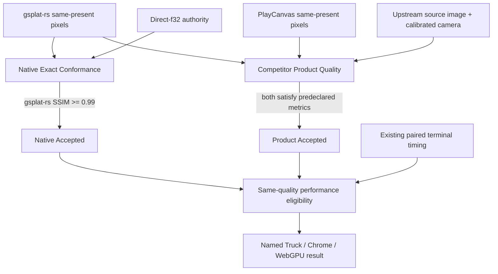

# Q1 Quality Lanes

## Decision

Q1 uses two independent quality lanes. A renderer matching gsplat-rs's own
Direct-f32 raster semantics is a conformance result, not a fair product-quality
definition for a competitor with a different precise Gaussian representation.
Same-quality performance is eligible only after both lanes accept.



The lanes do not share an authority:

- Native Exact compares only gsplat-rs against the immutable Direct-f32
  authority. Its SSIM threshold remains exactly `0.99`.
- Product Quality compares both endpoints against independently authored
  upstream source images under the corresponding calibrated cameras.
- A PlayCanvas score against Direct-f32 may be retained only as a mechanism
  diagnostic. It cannot accept or reject Product Quality.
- Attempt 10 remains an immutable v2 result and is never reinterpreted by the
  new contract.

## State reduction

| Native Exact | Product Quality | Q1 quality state | Performance |
| --- | --- | --- | --- |
| Rejected | any | Rejected | unavailable |
| Accepted | Deferred | Deferred | unavailable |
| Accepted | Rejected | Rejected | unavailable |
| Accepted | Accepted | Accepted | existing paired calculation may run |

Malformed authority identity, image hash, camera calibration, crop, color
domain or producer binding is an admission failure, not a quality miss. It
fails closed before a browser run whenever the missing input is discoverable
at preflight. A Deferred or Rejected result contains no delta, ratio, FPS,
direction or winner.

## Upstream Truck authority

The official Inria `tandt_db.zip` contains the source images and COLMAP
calibration used by the pretrained Truck model. The first authority slice used
two named views already represented by the current trace:

- URL: `https://repo-sam.inria.fr/fungraph/3d-gaussian-splatting/datasets/input/tandt_db.zip`
- bytes: `682628995`
- SHA-256: `816e62f22a161abbfe841d2a6b10cdf036e297c9fa289b3bfeee9c6ec526d7e1`

| Image | COLMAP image id | Camera model | JPEG pixels | Camera calibration pixels |
| --- | ---: | --- | ---: | ---: |
| `000001.jpg` | 1 | PINHOLE | 979x546 | 1957x1091 |
| `000108.jpg` | 108 | PINHOLE | 979x546 | 1957x1091 |

The image dimensions are approximately half the calibration dimensions, but
the scale is not rounded to `0.5`: `sx = 979 / 1957` and
`sy = 546 / 1091`. Product-quality intrinsics therefore scale `fx`, `cx` by
`sx` and `fy`, `cy` by `sy`. The source JPEG is not resized, blurred, cropped
or post-aligned for the first qualification smoke.

The authority receipt locks:

- official archive URL, byte count and SHA-256;
- JPEG, `cameras.bin` and `images.bin` SHA-256 values;
- the exact named COLMAP record, PINHOLE parameters, pose and per-axis scale;
- image dimensions and source scene identity;
- authority class `upstream_source_camera_images`.

External assets remain local research inputs and are not committed while their
redistribution rights are unresolved.

This first slice is accepted as an input-integrity mechanism, but its second
view is not the final product-quality view. `000108` was chosen to reuse the
old performance trace. The paper's official held-out Truck sequence is
`000001`, `000009`, `000017`, and so on. Formal two-view Product Quality uses
`000001 + 000009`; it does not let an unrelated legacy trace choose the
validation images.

The upstream project also publishes the exact Evaluation Images used for its
reported metrics:

- URL: `https://repo-sam.inria.fr/fungraph/3d-gaussian-splatting/evaluation/images.zip`
- HTTP byte length: `7,064,286,140`
- Truck aggregate `ours_30000`: SSIM `0.8787403703`, PSNR `25.1867847443`,
  LPIPS `0.1477580667`
- `000001`: SSIM `0.9103236794`, PSNR `26.25909805298`, LPIPS
  `0.1162385568`
- `000009`: SSIM `0.9118889570`, PSNR `26.6379737854`, LPIPS
  `0.1099530607`

Both retained ground-truth and `ours_30000` PNGs are 979x546 RGB8. Product
Quality will use the official ground-truth PNG bytes as its decoded pixel
authority, rather than introducing a browser JPEG decoder. The official
`ours_30000` render is a threshold-calibration baseline, not an endpoint and
not a competitor.

The Evaluation Images provenance authority is separate from the earlier
source-camera JPEG authority. Its first offline slice pins the exact archive
entry path, extracted relative path, byte count and SHA-256 for
`truck/results.json`, `truck/per_view.json`, and the `000001`/`000009` ground
truth plus `ours_30000` render PNGs. Every retained PNG must be 979x546,
non-interlaced RGB8. Duplicate JSON keys, missing or replaced files, path
escapes, symlinks and non-fresh output fail closed before publication.

The 7,064,286,140-byte archive was not retained locally. The receipt therefore
records the official URL and HTTP content length, but says
`archive_sha256_verified=false` and limits verification to the six pinned
extracted entries. It must not be described as whole-archive SHA verification.
Its class is `upstream_evaluation_images`; endpoint-generated or self-generated
images cannot substitute for it. Building this authority keeps Product Quality
`Deferred` and does not authorize performance.

The raw PNG metric was extended to accept strict non-interlaced RGB8 as well
as RGBA8, expanding RGB alpha to 255 without Canvas, color management or
resampling. Its locked 8x8 sRGB-luma/RGB-byte results are:

| View | SSIM | normalized RGB MAE | pixels with any RGB error >32 |
| --- | ---: | ---: | ---: |
| `000001` | `0.9169842309` | `0.0267901128` | `0.0318763633` |
| `000009` | `0.9196254631` | `0.0258173395` | `0.0287334388` |

Product Quality v1 is now frozen before either endpoint output exists. Every
endpoint and every view must independently satisfy all of:

- SSIM `>= 0.90`;
- normalized RGB MAE `<= 0.05`;
- fraction of pixels with any RGB channel error greater than 32 `<= 0.10`;
- endpoint alpha exactly 255 at every pixel.

There is no averaging across views or endpoints. The existing fraction over
3/255 remains a tight renderer-conformance diagnostic and is not a Product
Quality gate: even the accepted official render has roughly 69-70% of pixels
above that very small per-pixel threshold. These v1 thresholds cannot be
changed by a producer invocation and are not adjusted after seeing gsplat-rs
or PlayCanvas output.

The official repository describes these files as the reference images used to
produce its reported metrics. It also warns that current cleaned-up code may
not reproduce the paper metrics byte for byte, which is why Q1 pins the
published files instead of rerunning an unpinned CUDA environment.

Build the immutable local authority without launching a browser:

```bash
PYTHONDONTWRITEBYTECODE=1 python3 \
  tests/perf/build-q1-product-quality-authority.py \
  --view-set formal-000001-000009 \
  --archive target/qualification/q1-product-quality-source/tandt_db.zip \
  --source-dir target/qualification/q1-product-quality-source/truck-formal \
  --output /fresh/q1-product-quality-authority
```

The output path must not exist. The builder verifies the official archive,
all four extracted inputs, JPEG dimensions, PINHOLE model, named image records
and complete COLMAP binary boundaries before atomically publishing. Existing
output is never overwritten.

The CLI requires an explicit view-set name. The retained legacy
`legacy-000001-000108` authority remains verifiable, while formal Product
Quality uses `formal-000001-000009`; neither can be validated as the other.

## Independently verifiable slices

1. **Authority builder** — parse and validate the two upstream views, emit an
   immutable receipt, and run no browser.
2. **Lane reducer** — add pure Native/Product state reduction and focused tests;
   no producer or performance change.
3. **RGB authority decoder** — admit the official RGB8 ground-truth and
   `ours_30000` PNG bytes with the repository's raw PNG parser. Compute the
   locked-metric upstream baseline and freeze Product Quality thresholds. Run
   no endpoint. **Implemented; fixed-SHA review pending.**
4. **Exact pinhole camera** — carry independent `fx/fy/cx/cy` through the trace
   and both endpoint camera receipts. The existing vertical-FOV-only trace is
   not formal Product Quality evidence because it assumes `fx == fy`.
5. **One-view quality smoke** — render `000001` at exact 979x546 with one
   renderer-owned image per endpoint. Apply the already frozen metrics. No
   timing is retained and one view cannot unlock performance.
6. **Two-view qualification** — repeat for `000001` and `000009`; require both
   lanes to accept and static-repeat stability to pass.
7. **Performance admission** — only then bind the existing 1080p paired terminal
   timing to the dual-lane result. A new browser series requires the existing
   exact-SHA, immutable-root and one-shot authorization gates.

Each slice can terminate Accepted, Rejected or Deferred without forcing the
next slice. There is no required percentage lead over PlayCanvas and no
automatic retry loop.

## Explicit non-goals

- lowering the existing Native Exact `0.99` threshold;
- changing either renderer to imitate the other for qualification;
- treating one endpoint's output as the product-quality authority;
- deriving a performance ratio from Attempt 10;
- tuning thresholds after observing both endpoint images;
- using diagnostic shader timings or host screenshots as formal evidence.

## Exact-pinhole prerequisite

The source camera is centered but not square-pixel after exact per-axis image
scaling:

| Parameter | `000001` at 979x546 |
| --- | ---: |
| `fx` | `581.9245675736333` |
| `fy` | `578.6701201866216` |
| `cx` | `489.5` |
| `cy` | `273.0` |

The current trace and both render endpoints consume only vertical FOV, which
implicitly produces `fx = fy = 578.6701201866216`. The resulting horizontal
focal error is about `-0.5593%`. It is shared between the endpoints, but it is
not the upstream camera; counting that projection error as renderer quality
would be unfair. Therefore a 979x546 browser execution remains blocked until a
reviewed exact-pinhole receipt proves the full normalized projection in both
endpoints. Resizing or warping the authority image is not an allowed shortcut.

The first centered-pinhole core slice now carries `fx/fy` as
`CameraIntrinsics::focal_length_x_over_y`. Its default is exactly `1`, while
the renderer derives one effective projection aspect shared by CPU reference,
all existing GPU Exact paths and the FFI projection receipt. The existing WGSL
uniform layout and stable C camera ABI are unchanged. A representability bound
of `2^-16..=2^16` guarantees a finite, normal derived aspect for any positive
`u32` viewport; invalid calibration fails rather than being clamped.

This Rust struct-field addition is assigned to the project's `0.2` source API
boundary; it must not be released as a source-compatible `0.1.3` patch. The
stable v0.1 C ABI remains unchanged. If the overall refactor later decides to
retain v0.1 Rust source compatibility, this field must be replaced by an
additive calibrated-camera carrier before integration, not hidden by release
notes after the fact.

This core slice does not unblock an endpoint run by itself. The canonical
trace, Wasm/JS setter and receipt, and PlayCanvas custom projection still need
to carry and prove the same ratio. Principal-point offsets remain unsupported;
the formal source-camera authority proves that both selected Truck views have
`cx=W/2` and `cy=H/2` at the decoded 979x546 resolution, so no principal-point
approximation remains for this named scope.
