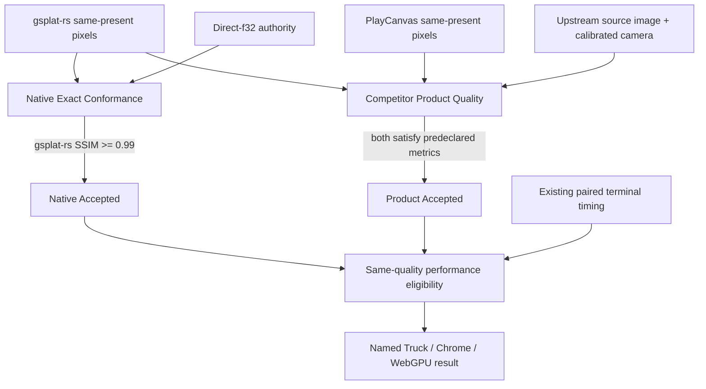

# Q1 Quality Lanes

## Decision

Q1 uses two independent quality lanes. A renderer matching gsplat-rs's own
Direct-f32 raster semantics is a conformance result, not a fair product-quality
definition for a competitor with a different precise Gaussian representation.
Same-quality performance is eligible only after both lanes accept.



The lanes do not share an authority:

- Native Exact compares only gsplat-rs against the immutable Direct-f32
  authority. Its SSIM threshold remains exactly `0.99`.
- Product Quality compares both endpoints against independently authored
  upstream source images under the corresponding calibrated cameras.
- A PlayCanvas score against Direct-f32 may be retained only as a mechanism
  diagnostic. It cannot accept or reject Product Quality.
- Attempt 10 remains an immutable v2 result and is never reinterpreted by the
  new contract.

## State reduction

| Native Exact | Product Quality | Q1 quality state | Performance |
| --- | --- | --- | --- |
| Rejected | any | Rejected | unavailable |
| Accepted | Deferred | Deferred | unavailable |
| Accepted | Rejected | Rejected | unavailable |
| Accepted | Accepted | Accepted | existing paired calculation may run |

Malformed authority identity, image hash, camera calibration, crop, color
domain or producer binding is an admission failure, not a quality miss. It
fails closed before a browser run whenever the missing input is discoverable
at preflight. A Deferred or Rejected result contains no delta, ratio, FPS,
direction or winner.

## Upstream Truck authority

The official Inria `tandt_db.zip` contains the source images and COLMAP
calibration used by the pretrained Truck model. The first authority slice uses
only two named views already represented by the current trace:

- URL: `https://repo-sam.inria.fr/fungraph/3d-gaussian-splatting/datasets/input/tandt_db.zip`
- bytes: `682628995`
- SHA-256: `816e62f22a161abbfe841d2a6b10cdf036e297c9fa289b3bfeee9c6ec526d7e1`

| Image | COLMAP image id | Camera model | JPEG pixels | Camera calibration pixels |
| --- | ---: | --- | ---: | ---: |
| `000001.jpg` | 1 | PINHOLE | 979x546 | 1957x1091 |
| `000108.jpg` | 108 | PINHOLE | 979x546 | 1957x1091 |

The image dimensions are approximately half the calibration dimensions, but
the scale is not rounded to `0.5`: `sx = 979 / 1957` and
`sy = 546 / 1091`. Product-quality intrinsics therefore scale `fx`, `cx` by
`sx` and `fy`, `cy` by `sy`. The source JPEG is not resized, blurred, cropped
or post-aligned for the first qualification smoke.

The authority receipt locks:

- official archive URL, byte count and SHA-256;
- JPEG, `cameras.bin` and `images.bin` SHA-256 values;
- the exact named COLMAP record, PINHOLE parameters, pose and per-axis scale;
- image dimensions and source scene identity;
- authority class `upstream_source_camera_images`.

External assets remain local research inputs and are not committed while their
redistribution rights are unresolved.

Build the immutable local authority without launching a browser:

```bash
PYTHONDONTWRITEBYTECODE=1 python3 \
  tests/perf/build-q1-product-quality-authority.py \
  --archive target/qualification/q1-product-quality-source/tandt_db.zip \
  --source-dir target/qualification/q1-product-quality-source/truck \
  --output /fresh/q1-product-quality-authority
```

The output path must not exist. The builder verifies the official archive,
all four extracted inputs, JPEG dimensions, PINHOLE model, named image records
and complete COLMAP binary boundaries before atomically publishing. Existing
output is never overwritten.

## Independently verifiable slices

1. **Authority builder** — parse and validate the two upstream views, emit an
   immutable receipt, and run no browser.
2. **Lane reducer** — add pure Native/Product state reduction and focused tests;
   no producer or performance change.
3. **One-view quality smoke** — generate one exact 979x546 camera trace and one
   renderer-owned image per endpoint. Predeclare SSIM, normalized RGB MAE and
   RGB-tail limits before examining endpoint output. No timing is retained.
4. **Two-view qualification** — repeat for `000001` and `000108`; require both
   lanes to accept and static-repeat stability to pass.
5. **Performance admission** — only then bind the existing 1080p paired terminal
   timing to the dual-lane result. A new browser series requires the existing
   exact-SHA, immutable-root and one-shot authorization gates.

Each slice can terminate Accepted, Rejected or Deferred without forcing the
next slice. There is no required percentage lead over PlayCanvas and no
automatic retry loop.

## Explicit non-goals

- lowering the existing Native Exact `0.99` threshold;
- changing either renderer to imitate the other for qualification;
- treating one endpoint's output as the product-quality authority;
- deriving a performance ratio from Attempt 10;
- tuning thresholds after observing both endpoint images;
- using diagnostic shader timings or host screenshots as formal evidence.
