# S0 Scalable Coverage and Streaming Contract

> Status: S0 Accepted; S1 proxy-image gate is frozen and Active. No product
> runtime is implemented by this file.
> Program plan: [Native Render Core Refactor](../../completed/2026-07-23-native-render-core-refactor/task_plan.md)
> Architecture source: [Scalable ownership](../../completed/2026-07-23-native-render-core-refactor/architecture.md#15-scalable-ownership)
> Evidence source: [Scalable track](../../completed/2026-07-23-native-render-core-refactor/benchmark_protocol.md#33-scalable-track)

## 1. Decision

Scalable uses an **offline-authored replacement hierarchy**. A small,
versioned manifest describes independently drawable proxy nodes and immutable,
content-addressed page objects. Each page locator can name a whole object or a
byte range, so the same `PageSource` contract can serve a local bundle, HTTP
objects, or an HTTP range-capable container without changing selection or
rendering policy.

The first reference asset is a directory/index bundle produced offline:

- the manifest contains topology, bounds, monotone geometric error, payload
  locators, contiguous source-leaf ranges, encoded/decoded sizes, hashes and
  codec identifiers;
- a node owns an independently valid Gaussian proxy for all source leaves below
  it; leaves retain the authored highest-detail splats;
- a page is only a transfer/cache unit and may contain several nodes; pages do
  not define visibility, alpha order or replacement semantics;
- payloads decode directly into the compact scene representation required by
  the shared renderer, never through a complete wide `SceneBuffers` owner;
- the bootstrap page contains a complete coarse cut and is admitted before any
  optional refinement request.

S0 selects this asset *model*, not a public file extension or frozen payload
codec. S1 and S2 may revise the private binary layout while proving proxy and
bounded-I/O behavior. A future SOG, RAD or SPZ adapter is eligible only if it
can produce this same internal manifest/page contract without weaker coverage,
budget or receipt semantics.

Plain PLY/SPZ files without authored hierarchy remain inputs to the existing
all-resident path when they fit. If they do not fit, admission returns an
explicit preprocessing requirement; the runtime does not read the complete
file merely to synthesize a hierarchy in memory.

## 2. Product promise and non-claims

Scalable promises that a scene larger than the all-resident budget can become
drawable from bounded metadata and a bounded bootstrap, then improve as pages
arrive while retaining valid whole-scene coverage. It does **not** promise that
every original source splat is resident or drawn each frame, and it must never
emit an Exact/Balanced full-source receipt.

The hard product boundary is:

- every authored source leaf is represented by exactly one node on the active
  hierarchy cut;
- the active cut changes only by complete parent/child replacement;
- every allocation is admitted under an explicit byte owner before work starts;
- every presented Scalable frame reports what was represented, at what error,
  with which bytes and which latency evidence;
- all active node payloads enter one global `SortedAlpha` plan. CPU/GPU ordering
  remains a measured renderer decision and is not chosen by page, platform
  wrapper or asset format.

“No holes” means no source-leaf lineage disappears during load, failure,
eviction or cancellation. It is a coverage invariant, not a claim that a coarse
proxy is pixel-identical to its leaves. Proxy quality has its own image/error
gates and receipts.

## 3. Terms and coverage model

| Term | Contract meaning |
| --- | --- |
| source leaf | One highest-detail authored Gaussian assigned to one hierarchy lineage. |
| proxy node | An independently drawable Gaussian set representing every source leaf in its subtree. It is not an arbitrary sample. |
| replacement group | All direct children of one parent for one local refinement transaction. A strict subset can be resident but can never replace the parent. |
| page | Immutable transfer/cache payload containing one or more node records. It is not a render layer or sort domain. |
| cut | An antichain of nodes whose descendant leaf sets are disjoint and whose union is the complete authored leaf set. |
| prepared cut | A validated cut whose required payloads and GPU resources are ready but are not yet public. |
| published cut | The cut bound to the last successfully presented semantic generation. |
| coverage generation | Monotone identity advanced only when a newly prepared cut is successfully presented. |

For every interior node `p` with children `children(p)`, leaf ownership is:

```text
leaves(p) = disjoint_union(leaves(c) for c in children(p))
```

A cut `C` is valid through the following recursive predicate:

```text
covers(n, C) =
  if n in C:
    no descendant of n is in C
  else if n is a leaf:
    false
  else:
    every child c in children(n) independently satisfies covers(c, C)

valid_cut(C) = every scene root r satisfies covers(r, C)
```

The recursive rule permits mixed-depth cuts. For a root with child subtrees
`A` and `B`, where `A` has children `A1` and `A2`, `{A1, A2, B}` is valid:
`A` is refined while `B` remains coarse. `{A1, B}` is invalid because `A2` is
uncovered, and `{A, A1, B}` is invalid because one lineage is represented
twice. Every selected node's leaf range is disjoint from every other selected
node's range, and the ranges of the complete cut equal the root ranges.

Parent and descendant payloads may briefly coexist in caches during a
transaction, but they are never drawn together in the release-gated Scalable
path and are never both counted as coverage. This avoids both missing opacity
and double opacity without forcing unrelated sibling subtrees to the same
depth.

## 4. Runtime ownership and flow

```mermaid
flowchart LR
    Source["Manifest locator"] --> Admit["Metadata-first admission"]
    Admit --> Select["Renderer SceneRequest + cut selection"]
    Select --> Fetch["PageSource"]
    Fetch --> Compressed["Compressed cache"]
    Compressed --> Decode["Bounded decode"]
    Decode --> Decoded["Decoded cache"]
    Decoded --> Upload["GPU page pool"]
    Upload --> Prepared["Prepared global cut"]
    Prepared --> Plans["Shared CPU/GPU Adaptive PlanSet"]
    Plans --> Raster["Global SortedAlpha raster"]
    Raster --> Present["Successful presentation"]
    Present --> Published["Published cut + receipts"]
    Published -->|"camera/error/budget feedback"| Select
```



Ownership remains aligned with the refactored renderer:

- `StreamedScene` owns validated manifest state, page lifecycles, the three
  byte-budget owners and immutable prepared snapshots;
- `Renderer` supplies `SceneRequest`, drains completed work, chooses the one
  global plan, encodes uploads/draws and publishes a coverage generation only
  after successful presentation;
- `PageSource` performs bounded asynchronous I/O and has no camera, Surface,
  cache-eviction, ordering or policy authority;
- Surface/offscreen/platform hosts adapt targets and handles only. They do not
  select pages, mutate budgets or run another controller.

One submission may contain upload, global order and draw work, but I/O/decode
completion never mutates the current cut directly. Resize, scene replacement,
camera revision and budget revision invalidate stale prepared work through
explicit generations.

## 5. Metadata-first admission

Opening a Scalable scene first reads only a bounded manifest/header. Before any
page request it validates:

1. schema/version, root set and topology (acyclic, reachable, bounded depth and
   counts);
2. child lineage partition and monotone parent/child error metadata;
3. finite bounds and supported SH/attribute/coordinate conventions;
4. page locator normalization, ranges, declared byte sizes and hashes;
5. checked totals and per-page maxima without summing into unchecked integers;
6. bootstrap decoded bytes, GPU bytes and worst allowed replacement overlap
   against the selected budgets and adapter limits.

Manifest bytes, node count, page count, string length and nesting depth have
separate admission caps. They cannot grow in proportion to an untrusted
payload before validation. Redirected/base URLs and decoded relative paths are
normalized before use; no page may escape the manifest's allowed source root.

Admission must not construct, retain or borrow a complete `SceneBuffers`, a
full source-index table, all decoded pages or one contiguous buffer sized by
the logical scene. A synthetic manifest representing a scene far larger than
RAM must still be inspectable with memory proportional to bounded metadata and
the selected bootstrap.

Contiguous leaf ranges make the partition proof metadata-only: a parent's
declared range must equal the ordered, gap-free union of its children's ranges.
The offline builder binds the range order to the highest-detail payload hash;
the runtime does not allocate one manifest entry or source index per splat.

## 6. Parent/child publication transaction

Refinement of an active parent `p` is one local transaction that replaces `p`
with all its direct children. After that transaction publishes, each child
subtree can refine independently, producing mixed-depth global cuts while the
recursive coverage predicate remains true:

1. select the complete replacement group and reserve all compressed, decoded,
   GPU and transition bytes;
2. fetch, hash and decode every required page under the captured scene/request
   generations;
3. upload every child payload and validate bindings/counts;
4. build one candidate global cut by replacing only `p` with all its direct
   children, leaving every other subtree's current cut unchanged;
5. prepare the global order/plan resources for that cut;
6. render and present the candidate;
7. only then publish its coverage generation and permit retired resources to
   become evictable.

Any failure or stale generation before step 7 discards the candidate and keeps
the prior published cut and its receipt. Coarsening is the reverse transaction:
the parent must be ready and successfully presented before its children become
evictable. At least one complete bootstrap cut remains protected while the
scene is live.

The GPU budget reserves bootstrap bytes, renderer plan/scratch bytes and enough
transition headroom for the largest admitted replacement group. If an authored
group cannot fit that bound, the asset is inadmissible for that budget; the
runtime may not replace children one at a time and create a transient hole.

## 7. Three independent byte budgets

All scalable allocations are charged exactly once to one of these owners.
Point counts may be reported, but never substitute for bytes.

| Budget | Charged bytes | Required behavior |
| --- | --- | --- |
| compressed/source | cached encoded pages, active response/range bodies, retry-retained bodies and decoder input ownership | reserve declared bytes before request; reject or evict before exceeding the limit |
| decoded CPU | decoded compact pages, decoder scratch, validation tables and CPU upload staging | decoder advertises peak before start; a page is not decoded if peak cannot be reserved |
| GPU | bootstrap, page pool, replacement overlap, upload destination/staging, global snapshot/order/project/raster scratch attributable to Scalable | intersect configured budget with adapter limits; allocate transactionally under validation/OOM scopes |

Current, reserved, in-flight and observed peak bytes are separate fields.
Sharing or aliasing may reduce physical bytes only when ownership can prove the
same allocation is not charged twice. “The page cache is 64 MiB” is not enough
to imply the decoded or GPU working set is bounded.

Deterministic eviction protects, in order: the published cut, the bootstrap
cut, an in-progress replacement transaction, then optional prefetched pages.
Unprotected ties use declared benefit/cost priority followed by stable page ID.
A tighter budget triggers a prepared coarser cut before child eviction. If even
the bootstrap plus required renderer resources does not fit, the budget change
fails explicitly and does not publish a partial scene or another profile.

## 8. Selection, quality and ordering

Each node has a conservative object-space geometric error and an offline proxy
quality receipt. Runtime projects geometric error to screen-space error (SSE)
using the actual camera and backing dimensions. It seeks the lowest-error cut
that fits all three budgets and the bounded request/upload work allowance.

Selection is benefit-per-byte scheduling, not a fixed splat-count switch:

- benefit is the estimated reduction in projected error for a complete
  replacement group;
- cost includes compressed, decoded, GPU transition and predicted active-plan
  work;
- hysteresis, minimum residency and cancellation generations prevent camera
  jitter from repeatedly fetching the same group;
- unmet requested SSE remains a valid coarse Scalable frame only when the
  receipt says `quality_satisfied=false` and gives the budget/network/availability
  reason. It cannot enter qualification as a target-quality frame.

Every published cut is flattened into one immutable active snapshot. Its
splats share the renderer's visibility, depth/tie contract, measured CPU/GPU
Adaptive selection and canonical `SortedAlpha` raster. Pages are never sorted
or blended independently. Page order, download order and cache address cannot
affect final alpha order.

## 9. Receipts

Receipt types are internal and immutable during S1--S6; S0 does not widen the
public API. Every unavailable measurement is `unavailable` with a reason, not
zero or an inferred substitute.

The retained proxy-quality record uses the complete leaf cut at the same frozen
camera and backing dimensions as reference. It records image hashes, SSIM,
normalized RGB MAE, alpha MAE, RGB outlier fraction and temporal delta error
for moving traces. The manifest names the metric/schema version and authored
validation set; runtime receipts report that identity plus achieved SSE.

Before S1 implementation or measurement begins, its task contract freezes the
validation assets, cameras, resolutions, required proxy cuts, numeric image
promotion thresholds and aggregation rule. S1 can be **Accepted** only when
those predeclared gates pass. A geometrically valid hierarchy that misses the
image gate may be retained as a research artifact, but S1 ends **Rejected**; if
the required authored/training evidence cannot be obtained, S1 ends
**Deferred**. Neither outcome unlocks S2--S5. S7 later retains the complete
quality-memory-latency curve, but it cannot retroactively waive S1. There is no
universal FPS threshold and no claim that geometric SSE alone proves appearance
quality.

### 9.1 Admission receipt

- manifest URI/identity, schema and generator version;
- manifest and source-content hashes where available;
- logical source-leaf count, node/page counts and hierarchy depth;
- attribute/SH/coordinate contract and payload codec IDs;
- declared bootstrap and largest-replacement bytes;
- requested/effective budgets and adapter-limit intersection;
- admitted, preprocess-required or rejected result with structured reason.

### 9.2 Page terminal receipt

- scene/request/page IDs and captured generations;
- locator/range, declared and observed encoded/decoded bytes, hash result;
- request queue, transfer, decode, upload and ready latency when observable;
- cache hit/source, retry count and terminal ready/cancelled/failed state;
- structured failure stage, retryability and reason.

### 9.3 Presented-cut receipt

- presentation ticket, camera/viewport/scene/coverage/budget generations;
- active node IDs or a content hash of their canonical list;
- complete-cut proof, represented source-leaf count and active splat count;
- requested and achieved maximum SSE, offline proxy-quality identity and
  `quality_satisfied` plus degradation reason;
- current/reserved/in-flight/peak bytes for each of the three budgets;
- page states, cache hits/evictions and replacement transactions completed;
- manifest-to-bootstrap, request-to-ready, ready-to-present and
  camera-revision-to-refinement latencies where the clock/domain permits;
- actual global plan/order backend, active V/C/D counts, render resolution and
  terminal success/failure identity.

Only the successful presentation boundary publishes a new cut receipt.
Preparation, queue submission, Surface unavailability and failed presentation
cannot advance public coverage, policy learning or latency success.

### 9.4 Frozen S1 proxy-image gate

The machine-readable contract name is
`gsplat-scalable-proxy-image-gate/v1`. This section freezes promotion evidence
before another proxy authoring rule, image claim or S1 measurement is allowed.
It is a contract only: it neither validates the current interior-node proxy nor
makes S1 complete.

S1 reuses the already integrated B1 evidence method instead of accepting a
second self-reported image protocol. The implementation of the S1 validator
must share or call the path confinement, canonical
`gsplat-benchmark/v1` validation, trace/resolution authority, successful
presentation join, RGBA8 PNG decoding/hash checks, metric recomputation and
validator-version receipt used by
[`validate-balanced-image-gate.py`](../../../../tests/perf/validate-balanced-image-gate.py).
At this contract baseline that validator has SHA-256
`14023327d729f4233d3244f86eeefa978443c23b81704263b6883642a725c5e8`.
This pin includes the B1 repair that admits only the valid initial
`viewport_generation = 0`, the Balanced-only depth-profile registry, and the
Candidate20 evidence classification plus moving-sequence/V/C/D/SortedAlpha
requirements. Those additions are fail-closed extensions for the Balanced
candidate lane; they retain the shared image metric, path, artifact, resolution
and full-quality Exact-reference contract used by S1.
The canonical benchmark validator has SHA-256
`4f68686d1fd5863376fd53ddf77da31516bd83c084c65a528f02d76462268a62`.
That pin includes the integrated terminal-queue throughput and fixed-GPU
renderer-identity validation. Those modes are additive and fail closed; S1's
canonical image artifacts retain their existing exact presentation/count
requirements.
A later shared-helper refactor is allowed only when B1 stays fail-closed and
the retained S1 artifact records the exact validator version and file hash.
A prose table, renderer log, screenshot pair or producer-computed score is not
formal evidence.

B1's full-membership assertion is not copied onto a proxy cut. The S1
validator first validates both lane-local canonical benchmark artifacts, then
joins the proxy lane to a separately hash-bound coverage receipt. The Exact
lane uses all `S` canonical source Gaussians. The proxy lane has `P` active
proxy Gaussians representing all `S` source leaves. Claiming
`active_splats=S`, `resident_splat_count=S` or `full_quality=true` for the
proxy lane when `P != S` is evidence forgery, not compatibility. Any common
helper therefore keeps the B1 full-membership behavior unchanged and adds
profile-specific S1 coverage semantics rather than weakening B1.

#### 9.4.1 Frozen assets and authority

The small bring-up asset is complete SH3 Kitsune. It is realistically
fetchable through the checked-in dataset manifest and is small enough to run
the evidence plumbing before the larger authored-camera case:

| Receipt | Frozen value |
| --- | --- |
| dataset manifest | `tests/perf/datasets/kitsune.json`, file SHA-256 `bcf8159b7f17b86d84f92590ffc3c45258456802296b3016fb4c3020ddafac7b` |
| source PLY | `tests/datasets/external/wakufactory_kitune/kitune1.ply`, SHA-256 `3bea1ec48ea91861fc8fad1df688a2cdb1db9b103735498b35d16d146f2551a2`, `65,892,441` bytes, `279,199` splats, SH3 |
| 1080p trace | `candidate-kitsune-quality-1920x1080-v1.json`, file SHA-256 `c996e5fe757d9d6661cce9f1dc303edcfbe8e12059e08bf8ab9f8eb566e54657`, content SHA-256 `8821c193506cdf7d67aa200248a45088c4750a3cd128ee29f6e2dc2d3a5bdb99` |
| A065 trace | `candidate-kitsune-quality-2412x1080-v1.json`, file SHA-256 `f9a8316369966928e63816141ef61f3b38af8758cf307f94673e3a234a7daf44`, content SHA-256 `0775baeda60585a2668a415c63702b0c51c6efc643f1779b0ac5e3c82067f56a` |

Kitsune is a contract/bring-up fixture only because those two traces are
deterministically framed candidates rather than training-camera-authored and
manually approved views. It may prove schema joins and expose an obviously bad
proxy, but it cannot Accept S1.

The minimum formal promotion asset is complete SH3 Bonsai because its two
views come from pinned official training-camera metadata while remaining
smaller than Truck:

| Receipt | Frozen value |
| --- | --- |
| source PLY | `tests/datasets/external/inria_3dgs/bonsai/point_cloud.ply`, SHA-256 `a16af6d8815498ffbf9eb5d5ee93f5bcc9dca34c4e3eb6f7a796ef9e97c0d273`, `308,716,644` bytes, `1,244,819` splats, SH3 |
| authored camera metadata | `tests/datasets/external/inria_3dgs/bonsai/cameras.json`, SHA-256 `41e623748141d5b1a292c2bcafbf9e897a3876f90c11a14618e9ac6190b05af3`, `116,695` bytes, `292` entries; selected camera IDs `0` and `146` |
| native trace | `candidate-bonsai-quality-1920x1080-v1.json`, file SHA-256 `ea7f09ca4cec606f153308f8c9ae707eff96efabd897752e5e462e9b76fe81a6`, content SHA-256 `8f0c419cdd090bc93bdfd46d5876f954c46b6d189e4f72d34c8a0fa475a87ef3` |
| A065 trace | `candidate-bonsai-quality-2412x1080-v1.json`, file SHA-256 `af70f0291197ad6e13b2dc1ab7bce77588a1d497db26721d039b1e30655a4d53`, content SHA-256 `b189dc06ac35f0a4e3805b5f53d7caab5a40c3e06e042836c848cb4aa185975f` |

Both Bonsai traces currently declare
`candidate_requires_manual_image_review`. Formal collection is locked until a
review receipt names both exact trace file/content hashes and confirms that
the two full-source Exact compositions are usable. Changing a camera, source,
trace, selected training-camera ID or display after seeing a proxy result
requires a new pre-measurement contract revision; it cannot repair a failing
candidate. An unavailable source/camera asset or missing review receipt is the
explicit S1 **Deferred** exit, not permission to use auto-framing.

Formal preflight also requires a separately reviewed `gsplat-dataset/v1`
authority manifest for this exact Bonsai source. The current candidate is
`tests/perf/datasets/bonsai.local-candidate.json`: it binds only the frozen
path/hash/bytes/count/SH values above plus bounds produced by the repository's
canonical spatial-analysis command over that same hash. It must be hash-checked
before collection and cannot be generated from benchmark output.

Because the pretrained archive does not publish an asset-specific model
license, the manifest remains `local_candidate`, restricted to local
research/evaluation and prohibited from redistribution. A successful local
identity check removes only the missing-dataset-authority prerequisite; it
does not authorize a public qualification claim. Public use remains Deferred
until rights are clarified. S1 remains Active, but a formal collection attempt
still has the explicit Deferred exit until the separate authored-camera review
and both required endpoint gates are available.

The existing three-splat SH3 fixture in
`crates/gsplat-hierarchy/tests/s1_proxy_fixture.rs` remains the smallest
structural contract fixture. It exercises cut and hash invariants only. It,
Kitsune, a deterministic source prefix or any generated solid-color image can
never substitute for the formal Bonsai quality case.

#### 9.4.2 Exact reference, endpoints and resolution

The image authority is the canonical Bonsai source PLY loaded through the
current all-resident Exact renderer: complete source membership and SH3,
`SortedAlpha`, no sampling/LOD/draw budget, and the same CPU/GPU ordering lane
as the compared proxy run. The hierarchy's complete leaf cut is a required
control and must reproduce the source bits and pass the same image gate, but it
does not replace the independently hashed source PLY as authority.

Formal S1 promotion requires both endpoint scopes below. Each comparison uses
the same endpoint, binary, order lane, trace frame, backing size and successful
presentation for Exact and proxy:

| Required endpoint | Real backing resolution | Formal role |
| --- | ---: | --- |
| Apple M4 native Metal | `1920x1080` | native reference and portability scope |
| Nothing A065 / Adreno 730 / Vulkan | actual `2412x1080` Surface | physical-mobile scope |

Requested, Surface, internal-render and presented dimensions must all equal
the named trace display. Dynamic resolution and upscaling are disabled. The
A065 drawable is re-probed immediately before collection; a changed size
Defers that scope until a new trace and pre-measurement contract revision exist.
Chrome/WebGPU, physical iOS and other desktop adapters are useful extension
scopes. An iOS Simulator is integration evidence only. Neither a simulator nor
one successful endpoint can replace either required scope or produce aggregate
S1 Accepted.

#### 9.4.3 Required cuts and captures

The hierarchy manifest, every referenced page and every materialized cut are
content-addressed. The retained artifact records the source hash, builder
commit/configuration, manifest hash, page hashes, ordered node-list hash and
active proxy count for each cut. The required cuts are derived before images
are examined:

1. `complete_leaf_exact`: the manifest's complete leaf cut; `P=S` and payload
   attributes are bit-exact to the canonical source;
2. `bootstrap_roots`: the canonically ordered complete root cut;
3. `mixed_depth_two_replacements`: start at `bootstrap_roots`, twice choose the
   active refinable node with the smallest
   `(leaf_range.start, leaf_range.end, node_id)` and atomically replace it with
   all direct children. The resulting cut must contain at least two depths.

A hierarchy too shallow to produce the required mixed-depth cut is Rejected as
an inadequate formal fixture. The chosen nodes may not be swapped after image
inspection. Extra cuts may be reported, but they cannot average away or replace
a required cut.

For every required cut and endpoint, retain authored views `0` and `1` plus a
post-warmup moving capture `0 -> 1 -> 0`, all paired with Exact. Also retain
fixed-view-0 replacement captures for `bootstrap_roots ->
mixed_depth_two_replacements -> complete_leaf_exact`; the unchanged Exact
frame is the temporal reference for those two cut changes. These offline
materialized-cut captures do not claim that the S4 streaming transaction
already exists.

#### 9.4.4 Numeric gate and aggregation

S1 intentionally uses the B0/B1 RGBA8 metric definitions and promotion limits
without relaxation:

| Metric | S1 v1 promotion gate |
| --- | ---: |
| 8x8-luma sRGB SSIM | `>= 0.99` per captured view/cut |
| normalized RGB MAE | `<= 0.005` per captured view/cut |
| RGB bad-pixel fraction (`> 3/255`) | `<= 0.02` per captured view/cut |
| normalized alpha MAE | `<= 0.001` per captured view/cut |
| alpha bad-pixel fraction (`> 1/255`) | `<= 0.005` per captured view/cut |
| temporal RGB residual MAE | `<= 0.005` for every camera and replacement transition |
| missing/invalid image, receipt or transition | zero allowed |

Scores are recomputed from retained, separate, non-interlaced RGBA8 PNG bytes;
producer-declared values must match within the existing B1 `1e-9` receipt
tolerance. Every view, transition, required cut, order lane and required
endpoint passes individually. Aggregation is logical `all`, never a mean:
summaries report minimum SSIM and maximum error, but cannot hide one failure.
CPU and GPU ordering must each be forced at least once on both required
endpoints; Adaptive is outside S1 proxy authoring qualification. Frame time,
FPS and proxy-point reduction are recorded observations, not promotion gates.

#### 9.4.5 Coverage and terminal receipts

Each retained proxy frame joins one canonical benchmark terminal to one
successful presented-cut receipt with the same scene, camera, viewport,
contract, cut, plan, order and presentation generations. The coverage receipt
proves:

- canonical source hash and logical source-leaf count `S`;
- hierarchy manifest/hash, cut name, ordered node-list hash and all page hashes;
- antichain validity, represented leaf count `R=S`, missing leaves `0`, overlap
  count `0`, and parent/descendant overlap `false`;
- active proxy splat count `P`, source SH3 representation policy and no random
  sampling, missing page, lowered SH or partial-child publication;
- `0 <= C <= V <= P`; Candidate execution has `D=V`, while exact contributor
  compaction has `D=C`. `S`, `R` and `P` are never substituted for `V/C/D`;
- terminal actual global plan/order backend and a successful primitive
  presentation ticket. Unavailable V/C/D or coverage fields invalidate the
  formal run rather than becoming zero or capacity.

The Exact lane independently proves the existing complete-source B1 identity
and V/C/D rules. Reference and proxy artifacts use distinct run IDs and image
files, match build/profile and pair identity, and retain their raw frame and
terminal evidence. Random source sampling, a deterministic prefix, a reduced
backing texture, upscaling, a missing page, structural tests alone, simulator
output, or a single endpoint is never an accepted substitute.

#### 9.4.6 Finite S1 decision

- **Accepted:** all frozen assets and authored-camera review receipts exist;
  the complete leaf control and both required proxy cuts pass structural,
  coverage, per-view and temporal gates in forced CPU and forced GPU order on
  both required real endpoints; every canonical artifact join validates.
- **Rejected:** valid evidence exists but any required cut, view, transition,
  endpoint, coverage/V/C/D invariant or numeric threshold fails; or the
  hierarchy cannot produce the required cut. The current geometric proxy may
  remain labelled research, but it does not unlock S2--S5 and the frozen gate
  is not weakened after the result.
- **Deferred:** the canonical source, official training-camera metadata,
  authored-camera review, physical A065 access/authorization, locked toolchain
  or another prerequisite needed before a valid run is unavailable. The exact
  missing authority and attempted read-only preflight are recorded; no proxy
  or product claim remains. Because S1 requires two real endpoints, a Deferred
  required scope makes aggregate S1 Deferred even if the other scope passes.

There is no fourth tuning state. Correctness fixes may produce one replacement
candidate under this unchanged contract; changing the authoring method after a
Rejected candidate is a new bounded S1 candidate, not an open-ended retry loop.

## 10. Failure and recovery contract

| Failure | Required result |
| --- | --- |
| invalid/cyclic/oversized manifest | reject before page allocation; structured admission failure |
| missing/hash-invalid/invalid page | fail that request; keep current parent coverage; never publish partial children |
| transient network failure | bounded retry/backoff under the same generation and byte reservation; terminal failure after declared attempts |
| cancellation or stale generation | release its reservations; stale completion cannot populate cache or cut |
| decoded/GPU budget pressure | evict only unprotected data or prepare a complete coarser cut first |
| adapter limit or GPU OOM/validation error | fail candidate transaction; preserve prior published cut and profile |
| Surface unavailable/present failure | do not publish the prepared cut or success receipt |
| bootstrap cannot fit or is corrupt | fail scene admission; do not draw an arbitrary subset |

Retry is finite and observable. Repeated failures do not lower SH degree,
sample source points, change resolution, switch to Exact/Paged, or spin until a
performance target happens to pass.

## 11. Why historical Paged is not Scalable

The retained Paged diagnostic is useful evidence about slots and residency,
but it violates the Scalable ownership contract:

- `LocalScenePageSource` borrows a complete `SceneBuffers`;
- page metadata retains source indices into that full owner;
- spatial analysis and global source sorting require the full scene;
- scheduling/extraction/packing/color work are synchronous in the frame path;
- four GPU slots are a fixed diagnostic configuration, not three independent
  byte-budget owners;
- its coarse cover is sampled from source splats, not an independently valid
  authored proxy hierarchy with measurable error;
- it has no metadata-first remote source, complete-child replacement
  transaction, bounded compressed/decoded caches or Scalable receipts.

No S task may rename, wrap or automatically select that implementation as its
starting runtime. Reusable low-level slot-generation or checked-payload ideas
may be extracted later only after their ownership no longer depends on full
`SceneBuffers`; such reuse is not evidence that Paged already streams.

## 12. Research decision record

External sources guide the design but are not local completion evidence.

| Source | Accepted | Rejected or deferred |
| --- | --- | --- |
| [PlayCanvas Streamed SOG format](https://developer.playcanvas.com/user-manual/gaussian-splatting/formats/streamed-sog/) and [LOD streaming guide](https://developer.playcanvas.com/user-manual/gaussian-splatting/building/lod-streaming/) | spatial hierarchy, independently addressable chunks, one LOD per region and coarse-first loading | do not bind the core to WebP/SOG; distance thresholds and a global splat-count budget alone do not prove byte bounds or proxy quality |
| [Spark 2.0](https://github.com/sparkjsdev/spark/blob/main/docs/docs/new-features-2.0.md) and [Spark renderer](https://github.com/sparkjsdev/spark/blob/main/docs/docs/spark-renderer.md) | root-to-leaf frontier, fixed shared GPU page pool, range-capable `.RAD` assets and viewpoint-prioritized fetch | do not copy platform point-count defaults, browser worker ownership or assume its file/runtime representation is portable to native `wgpu` |
| [OGC 3D Tiles 1.1](https://docs.ogc.org/cs/22-025r4/22-025r4.html) | geometric error projected to SSE and explicit `REPLACE` refinement semantics | do not adopt the generic 3D Tiles/glTF ecosystem or `ADD` refinement for transparent Gaussian coverage |
| [Hierarchical 3D Gaussians](https://repo-sam.inria.fr/fungraph/hierarchical-3d-gaussians/) | interior Gaussians must represent descendants, hierarchy cuts, screen granularity and authored quality validation | training-time joint optimization and smooth parent/child interpolation are Deferred until a basic atomic replacement path passes image gates; interpolation cannot be used to hide incomplete children |
| [Niantic SPZ](https://github.com/nianticlabs/spz) | compact, versioned page-payload candidate and bounded/streaming decode inspiration | compression alone supplies no spatial hierarchy, replacement rule, page cache or active-cut quality contract; a whole SPZ is not a Scalable scene |

## 13. S1--S7 execution order

Each task owns one narrow result and ends **Accept**, **Reject** or **Defer**.
There is no fixed FPS or competitor-win completion gate.

| Task | Independently verifiable result | Hard gate | Reject / Deferred boundary |
| --- | --- | --- | --- |
| S1 authored proxies | deterministic offline hierarchy builder plus versioned manifest/page fixture | before work, freeze validation assets/cameras/resolutions, required cuts, numeric promotion thresholds and aggregation; leaf lineage partitions exactly; every node is finite, independently drawable and has monotone error; complete leaf cut reproduces source; every required proxy cut passes the frozen image gate | Reject any proxy/merge method that misses the gate; missing authored/training evidence is Deferred. A geometric baseline may remain research, but only S1 Accepted unlocks S2--S5 |
| S2 metadata-first source | local and HTTP/range `PageSource` plus bounded decoder into compact pages | huge synthetic logical scene opens without full body or `SceneBuffers`; ranges/hashes/path rules/check arithmetic and cancellation pass | Reject any API requiring full input ownership; real remote endpoints may be Deferred while deterministic local HTTP evidence closes core behavior |
| S3 three caches | independent compressed, decoded and GPU budget owners with reservation and deterministic eviction | adversarial request/decode/upload schedules never exceed any declared peak; stale work releases reservations; bootstrap/transition headroom is protected | Reject oversubscription or count-only budgeting; platform memory-pressure callbacks wait for S6 |
| S4 selection/replacement | SSE selector and transactional refinement/coarsening over simulated delayed, failed and reordered pages | every published cut passes the recursive coverage predicate; tests include mixed-depth cuts such as `{A1,A2,B}`, incomplete siblings, ancestor/descendant duplication, independent subtree refinement and coarsening; parent remains until all direct children are ready and presented; no holes/double coverage under failure/eviction | Reject non-atomic or uniform-depth-only selection; transition interpolation remains Deferred unless separately image-qualified |
| S5 global render snapshot | one immutable active cut consumed by the existing shared plan boundary | materialized-cut oracle matches page-built cut; all pages share one global CPU/GPU order and canonical raster; successful present is publication boundary | Reject per-page sorting/render graphs or a second renderer scheduler; unavailable portability endpoint is Deferred, not emulated |
| S6 platform feedback | bounded memory/thermal/network signals adjust budgets inside the same Scalable contract | hysteresis/cooldown/generation tests; no hidden profile/SH/resolution change; current cut remains valid during budget changes | Each unavailable platform signal is Deferred and reported; it does not block deterministic manual budgets on other endpoints |
| S7 qualification/close | retained quality-memory-latency curves on real oversized scenes and available native/Web/mobile endpoints | receipt identity, coverage, budgets, same camera/resolution, raw images and terminal timings validate; claims are endpoint-scoped | Reject product promotion if quality/complexity is unjustified; unavailable iPhone/browser/device evidence is Deferred explicitly, never inferred |

The tasks are sequential at their semantic seam: S2--S5 are locked until S1 is
Accepted against its predeclared proxy-image gate; Rejected/Deferred S1 cannot
be bypassed with a geometric-only asset. S3 owns resources used by S4, and S5
is the first product renderer integration. Read-only research or fixture
preparation may run in parallel only with disjoint write ownership. Root review
has accepted S0 and updated the program ledger; S1 remains Active until its
frozen proxy-image gate reaches a terminal result.

## 14. S0 acceptance boundary

S0 is ready for root review when:

- the selected asset model, cut invariant, metadata admission and page roles are
  unambiguous;
- the three byte budgets account for in-flight, transition and peak memory;
- publication, errors, receipts and historical Paged rejection are explicit;
- S1--S7 have finite independent evidence and Reject/Deferred exits;
- every local/external link resolves and the active ledger still names only S0.

Acceptance of this document proves design closure only. It proves no authored
proxy quality, bounded decoder, cache, streaming runtime, endpoint behavior or
performance. Until S1--S5 pass their gates, the repository has no Scalable
product path.
